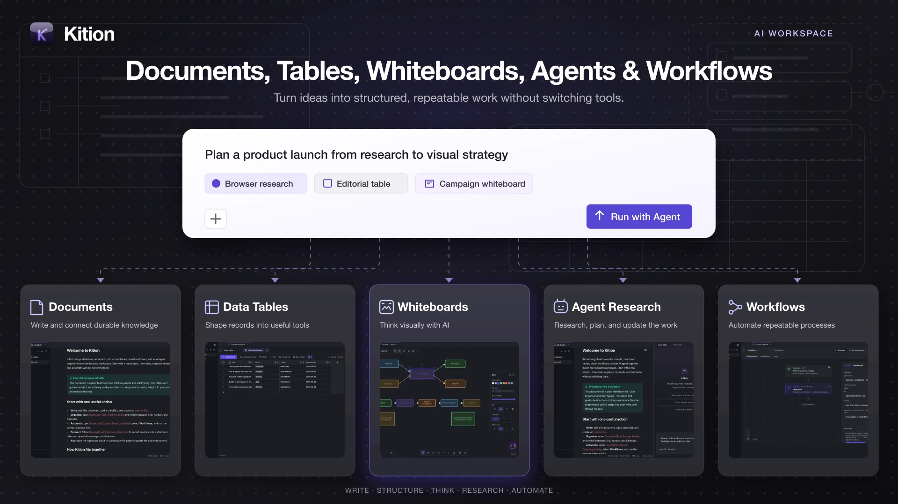
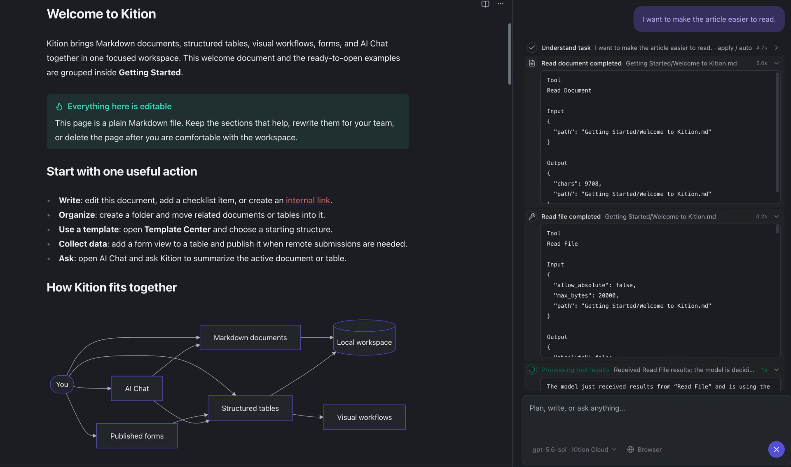
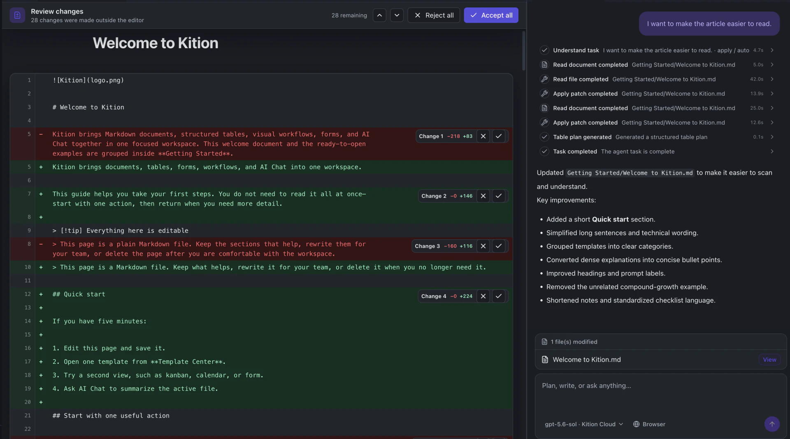
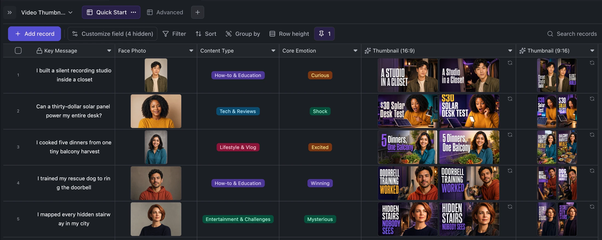
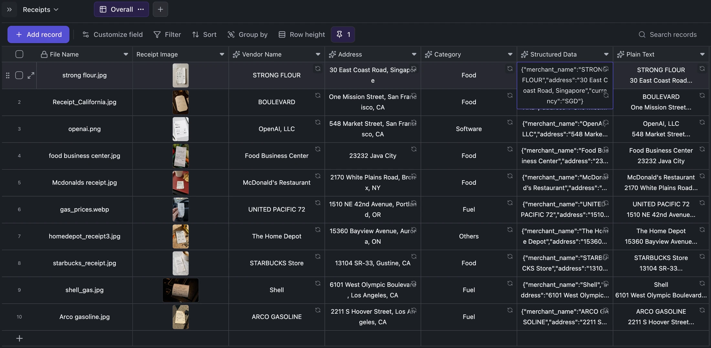
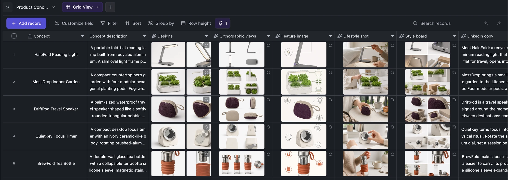
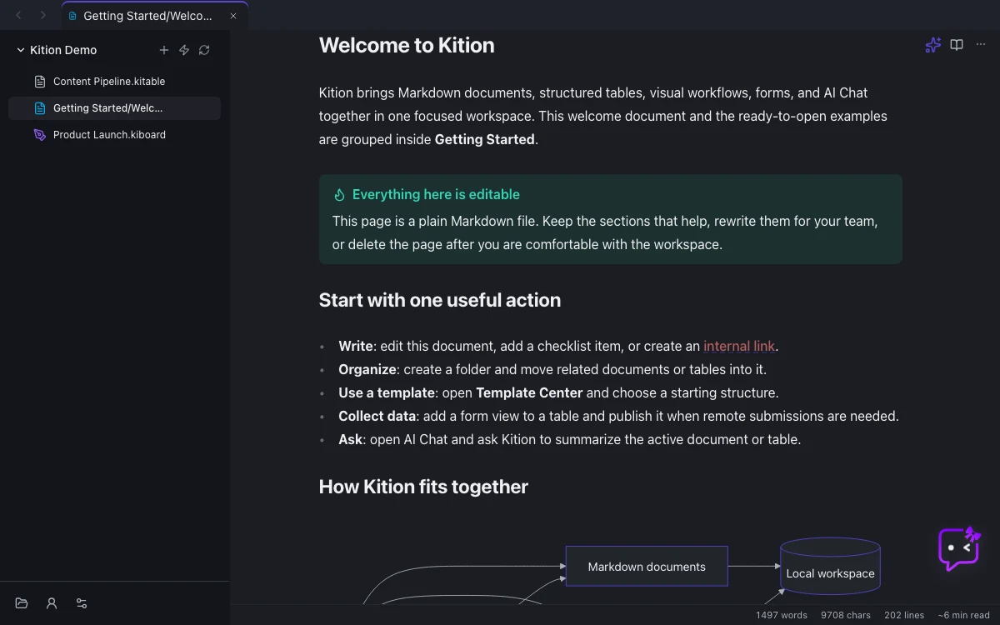
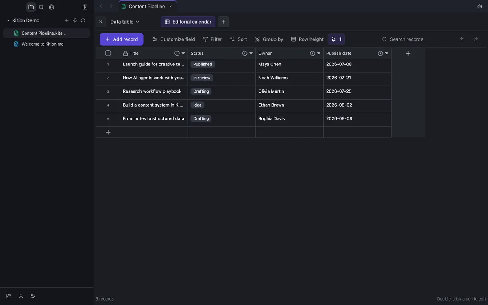
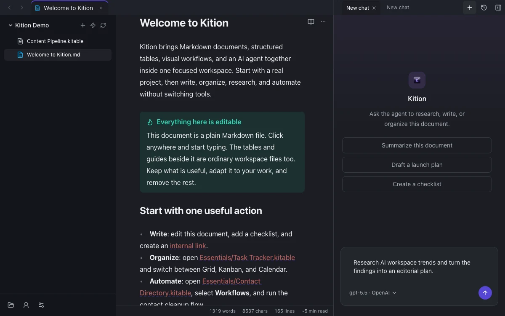
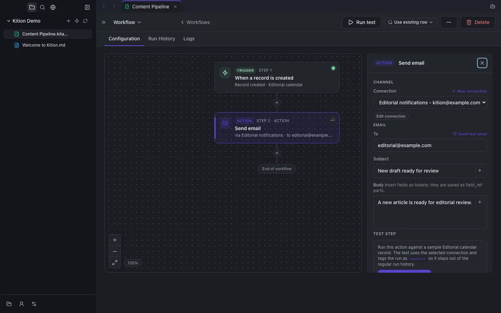

<h1 align="center">
  <a href="https://kition.ai"></a> Kition
</h1>

<p align="center">
  <strong>English</strong> ·
  <a href="README.zh-CN.md">简体中文</a> ·
  <a href="README.ru-RU.md">Русский</a> ·
  <a href="README.ja-JP.md">日本語</a> ·
  <a href="README.vi-VN.md">Tiếng Việt</a> ·
  <a href="README.fr-FR.md">Français</a> ·
  <a href="README.de-DE.md">Deutsch</a> ·
  <a href="README.es-ES.md">Español</a>
</p>

<p align="center">
  <strong>Documents, Tables, Agents, and Workflows in one desktop workspace.</strong><br />
  Write connected knowledge, build data tools, research in the browser, and automate repeatable work.
</p>

<p align="center">
  <a href="https://github.com/KitionAI/kition/actions/workflows/ci.yml"></a>
  <a href="https://github.com/KitionAI/kition/releases/latest"></a>
  <a href="https://github.com/KitionAI/kition/releases"></a>
  <a href="LICENSE"></a>
  
  
  
</p>

<h3 align="center"><a href="https://github.com/KitionAI/kition/releases/latest"><ins>Download Kition</ins></a></h3>

<p align="center">
  <a href="https://kition.ai">Website</a> ·
  <a href="https://github.com/KitionAI/kition/releases">Releases</a> ·
  <a href="CONTRIBUTING.md">Contributing</a> ·
  <a href=".github/SUPPORT.md">Support</a> ·
  <a href=".github/SECURITY.md">Security</a>
</p>

<p align="center">
  
</p>

Kition brings Markdown documents, structured table files, a tool-using AI
agent, browser research, and visual workflows into one desktop workspace.
Instead of making every task begin in a blank chat, Kition gives the Agent
editable project files, typed records, attachments, and visible processes to
work with. This makes powerful AI operations easier to inspect, correct, and
repeat without handing context between disconnected tools.

> Kition is currently in beta. Back up important workspaces and review agent
> changes before relying on them in production workflows.

## Why Kition

- **Connected documents.** Write Markdown with live preview, links, backlinks,
  callouts, code, math, diagrams, daily notes, search, and export.
- **Structured data beside the knowledge.** Turn research and content into
  typed records, formulas, filters, groups, views, attachments, and AI fields.
- **An Agent that can act.** Research in browser tabs, inspect documents and
  table schemas, update content, and save useful output into the active project.
- **Reviewable document edits.** Let the Agent edit the active document, inspect
  every addition and deletion, then accept or reject individual changes.
- **Visible automation.** Assemble trigger-and-action workflows, test steps,
  inspect run history, and resolve missing inputs before enabling a process.

## Let the Agent Edit—Keep the Final Say

Instead of returning another suggestion to copy and paste, the Kition Agent can
read the active Markdown document, make scoped changes, and write the result
back into the workspace. The document and the complete task trace remain
visible together while the Agent works.

<p align="center">
  
</p>

When a file changes outside the editor, Kition opens a document review surface
that highlights additions, deletions, and rewrites. Each change can be accepted
or rejected individually, or the complete edit can be reviewed as one set.

<p align="center">
  
</p>

This creates a controlled document workflow: describe the goal in natural
language, let the Agent edit the real file, inspect the diff, and decide exactly
what remains in the final document.

## Start With Work, Not a Blank Prompt

A capable Agent is useful, but a blank prompt still asks the user to design the
task, describe every input, choose an output format, and recover when a step
goes wrong. Kition moves that complexity into familiar work surfaces:
documents, table fields, records, templates, and workflows.

The built-in scenarios below are ordinary `.kitable` files. Their prompts,
field relationships, generated assets, and review states stay visible and can
be adapted to a real project.

### Generate campaign assets in batches

Start with a key message and a face photo. Typed fields keep the content type
and intended emotion explicit, while AI fields generate linked 16:9 and 9:16
thumbnail variants for every record. The table becomes both the batch queue and
the review surface.

<p align="center">
  
</p>

### Turn receipt images into searchable records

Drop receipt photos into an attachment field. Vision-powered fields extract
the vendor, address, category, structured JSON, and plain OCR text directly
into the same row. The results can then be filtered, corrected, summarized by
the Agent, or passed into a review workflow.

<p align="center">
  
</p>

### Expand one product brief into a complete asset pipeline

One product concept can drive multiple design candidates, orthographic views,
a feature image, a lifestyle shot, a style board, and launch copy. Each result
remains attached to the source record, so the full chain is easier to compare,
regenerate, and hand off than a collection of disconnected chat outputs.

<p align="center">
  
</p>

These scenarios show the intended Kition loop: use documents for narrative
context, tables for structured state, the Agent for uncertain work, and
Workflows for steps that should become repeatable.

## Product Tour

<table>
<tr>
<td width="42%" valign="middle">

### Write connected documents

Write Markdown with live preview, internal links, backlinks, tags, outlines,
embeds, callouts, code, math, diagrams, templates, daily notes, tabs, and
full-text search. Export finished work to PDF or DOCX when it needs to leave
the workspace.

</td>
<td width="58%">
  
</td>
</tr>
<tr>
<td width="58%">
  
</td>
<td width="42%" valign="middle">

### Turn data into useful tools

Create structured table files with typed fields, attachments, formulas, filters,
sorting, grouping, multiple views, and fast record editing. Use them for
research, content pipelines, lightweight CRM, inventory, or project tracking.

</td>
</tr>
<tr>
<td width="42%" valign="middle">

### Give the agent real context

Ask the Kition agent to read and update documents, inspect table schemas,
create or modify records, research in browser tabs, use tools, and follow a
plan. Agent output can be written back into the active workspace.

</td>
<td width="58%">
  
</td>
</tr>
<tr>
<td width="58%">
  
</td>
<td width="42%" valign="middle">

### Automate repeatable work

Build trigger-and-action workflows on a visual canvas. Start from a template,
assemble a workflow manually, test individual steps, inspect run history, and
resolve missing inputs before enabling it.

</td>
</tr>
</table>

Also included:

- AI-assisted table fields for generating text, structured values, and media
  from record context.
- Browser research tabs that stay inside the workspace and can be used by the
  agent when a task needs live web context.
- Email connections and inbox-to-table workflows. See
  [Email Connections](docs/email-connections.md).
- Model, proxy, MCP, account, usage, update, and desktop integration settings.
- A seeded Getting Started workspace with practical document, table, and
  workflow examples.

## Install

Desktop builds are published through
[GitHub Releases](https://github.com/KitionAI/kition/releases/latest).

- **macOS:** download the latest `.dmg`.
- **Windows:** download the latest installer.
- **Previous versions:** browse the complete
  [release history](https://github.com/KitionAI/kition/releases).

## Run From Source

Requirements:

- Node.js 22.19.0
- pnpm 10.33.0

```bash
pnpm install --frozen-lockfile
pnpm dev
```

`pnpm dev` verifies and caches the pinned released runtime outside the Git
worktree, then starts the Electron client.

For renderer, component, editor, and style work that does not require runtime
integration:

```bash
pnpm dev:web
```

The web preview runs without the private runtime and is the fastest path for
most client-side contributions. More options are documented in
[Runtime development](docs/runtime-development.md).

## Open Source Boundary

This repository contains the public React and Electron client:

- document, table, Agent, browser, settings, email, scenario, and workflow UI;
- the Electron shell and desktop integration;
- public runtime contracts, mocks, fixtures, and black-box tests;
- packaging and unified release workflows.

The Kition runtime is maintained separately and its source is not included in
this repository. Released desktop builds pair the public client with a signed
runtime. Source checkouts communicate with it only through the public contracts
in [`contracts/runtime/`](contracts/runtime/).

There is no Go source, Go module, or runtime source-build fallback in this
repository.

## Technology

| Area | Stack |
| --- | --- |
| Desktop | Electron |
| Interface | React, TypeScript, Vite |
| Documents | CodeMirror, Marked, Mermaid, KaTeX |
| Data and state | IndexedDB, Jotai, Zod |
| Testing | Vitest, Playwright |

## Contributing

Issues and pull requests for the public client are welcome.

1. Read [CONTRIBUTING.md](CONTRIBUTING.md) for setup, scope, and required checks.
2. Follow the [Kition Development Standard](docs/development-standard.md),
   including the recommended Orca worktree workflow.
3. Keep changes inside the public client/runtime contract boundary.
4. Report security-sensitive issues through
   [.github/SECURITY.md](.github/SECURITY.md), not a public issue.

For product questions, account help, and private workspace concerns, see
[.github/SUPPORT.md](.github/SUPPORT.md).

## Repository Layout

```text
.
├── .github/                 # Community health files and CI workflows
├── contracts/runtime/       # Public runtime schemas
├── docs/                    # Product, contributor, design, and runtime docs
├── e2e/                     # Playwright black-box tests
├── electron/                # Electron shell and runtime manager
├── public/                  # Static assets and onboarding files
├── scripts/                 # Repository checks and inspection entry points
├── src/                     # React application organized by feature domain
├── tooling/                 # Build, lint, and test configuration
└── package.json             # Development, test, and packaging commands
```

## License

The Kition public client is licensed under the
[GNU Affero General Public License v3.0 only](LICENSE).

The separately distributed Kition runtime is governed by its own license and
is not included in this repository.
