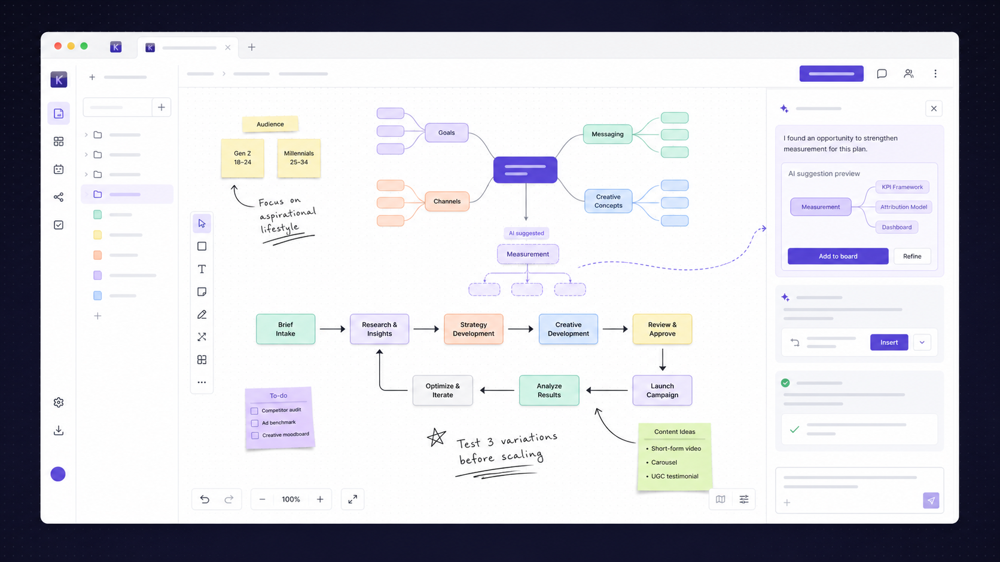

# Kition AI Board Native Development Plan

> Active direction: Kition continues with a native clean-room Board. The
> focused next-stage execution plan is
> [AI-Enabled Canvas Clean-Room Replication Plan](ai-enabled-canvas-replication-plan.md).


Research snapshot: 2026-08-23

Development branch: `feat/kition-native-whiteboard`



## 1. Decision

Kition will build a native Board instead of integrating a third-party board,
diagram, mind-map, or canvas-editor package.

The implementation will use the capabilities already available in the Kition
client and browser platform:

- React for product composition and state ownership;
- SVG as the only scene renderer for shapes, committed text, connectors,
  selection geometry, mind maps, flowcharts, and freehand paths;
- DOM overlays only for active text editing, menus, toolbars, and Agent UI;
- browser pointer, keyboard, clipboard, and export APIs;
- Kition-owned document schema, history, layout, persistence, and AI patches.

The existing Workflow canvas remains focused on executable automation. The new
Board feature remains internally owned by the existing
`src/features/whiteboard` domain.

No external board repository will be vendored, no third-party board runtime
will ship in the product, and no third-party source, UI, icons, brand, or
assets will be copied into Kition.

Canvas 2D and WebGL are outside the scene-rendering contract. A temporary
off-screen canvas may be used only to rasterize a serialized SVG for PNG export.

The first shippable AI Board includes the native SVG canvas, semantic mind
maps and flowcharts, Agent patch preview, and prompt-to-image with variants.
Cross-surface Workflow conversion is a follow-up hardening step.

## 2. Native implementation contract

Kition Board is a clean-room, product-owned implementation. It does not depend
on a third-party whiteboard SDK, scene model, record format, renderer, UI kit,
cloud service, or marketplace asset.

Implementation work follows this sequence:

1. Record the observed behavior as an English Kition requirement and test.
2. Design the behavior against the Kition Board schema and design system.
3. Implement the behavior from scratch inside the owning Kition feature.
4. Verify the behavior using Kition fixtures and black-box interaction tests.

Multiplayer sync, public SDK extensibility, live website embeds, and marketplace
assets are outside the current delivery scope. Kition-owned capabilities replace
them only where the product requires the same user outcome.

### Architecture boundaries

The useful reference is not one canvas component. It is a set of separable
editor subsystems:

| Editor subsystem | Responsibility | Kition native implementation |
|---|---|---|
| Reactive record store | Normalized shapes, bindings, assets, pages, migrations, and record diffs | `BoardStore` with versioned `.kiboard` records and typed diffs |
| `ShapeUtil` registry | Geometry, rendering, handles, resize rules, text, hit testing, and export per shape | `BoardElementDefinition` registry under `src/features/whiteboard/lib` |
| Tool state nodes | Explicit idle, pointing, translating, resizing, rotating, brushing, drawing, and editing states | `BoardInteractionMachine` with typed states and pointer ownership |
| Binding utilities | Maintain arrow endpoints and related-shape invariants | `BoardBindingEngine` with connector endpoint records and repair rules |
| History manager | Atomic record diffs, marks, undo, redo, bail, and squash | `BoardHistoryManager` using commands and reversible `BoardRecordDiff` values |
| Snap manager | Center, edge, gap, handle, and resize snapping with indicators | `BoardSnapManager` and SVG snap-guide overlay |
| Spatial index | Incremental bounds index for viewport queries and hit testing | Board R-tree index with viewport culling and dirty-record updates |
| Hybrid renderer | HTML scene hierarchy, SVG vector shapes, HTML text/media, and limited canvas overlays | SVG committed scene, DOM editing overlays, and optional transient canvas only |
| UI action registry | Clipboard, grouping, layout, z-order, rotation, zoom, and keyboard commands | Kition Board command registry shared by toolbar, menus, shortcuts, and Agent |
| Agent prompt-part registry | Selection, viewport, screenshot, visible shapes, peripheral clusters, history, todos, and lints | `AgentBoardContextProvider` registry inside `src/features/agent` |
| Agent action registry | Typed create, update, move, resize, rotate, align, review, and message actions | Validated `AgentBoardAction` protocol translated into preview diffs |
| Agent record diffs | Streaming provisional changes plus accept or reject | Purple Board preview layer with one-click accept, reject, and one-step undo |

The central design decision is to separate the Board model, interaction engine,
renderer, command history, and Agent protocol. The current `useWhiteboardEditor`
hook combines all five and must be split before commercial parity work grows.


The Agent combines several context channels before acting:

- the user's request;
- the current selection;
- the visible viewport;
- explicitly attached shapes or canvas regions;
- recent user actions;
- a screenshot of the visible canvas;
- simplified semantic data for visible shapes;
- summaries of off-screen shape clusters;
- conversation and action history;
- lint findings about possible canvas problems.

That combination of semantic scene data, spatial context, visual input, and an
action protocol is the most important competitive pattern for Kition to study.

### What Kition should reproduce conceptually

- AI understands both object semantics and spatial arrangement.
- AI works through explicit, typed canvas actions.
- Selection and viewport scope constrain the task.
- The Agent can continue over multiple action steps instead of returning one
  static image.
- The user can inspect what the Agent is doing.
- Agent context can include shapes, a region, or the whole board.

### What Kition should improve

- AI changes should first appear as a purple preview patch instead of being
  committed immediately.
- Every accepted AI patch must be undoable in one operation.
- Mind-map nodes and flowchart nodes should be first-class semantic elements,
  not only generic rectangles and arrows.
- Shapes should retain links to Kition documents, headings, table records, and
  research sources.
- A conceptual flow should convert into a Workflow draft only after explicit
  trigger/action validation.
- The Agent should be able to turn board branches into documents and table
  records without flattening the board into an image.

## 3. Product scope

### Core modes

Kition Board is one surface with three creation modes:

1. **Freeform board**
   - freehand pen;
   - text;
   - sticky notes;
   - basic shapes;
   - generated and imported image nodes;
   - arrows and connectors;
   - frames and groups.
2. **Mind map**
   - semantic parent-child nodes;
   - sibling and child insertion shortcuts;
   - automatic tree layout;
   - collapse and expand;
   - branch color and direction controls.
3. **Flowchart**
   - process, decision, start/end, data, and note nodes;
   - directed connectors;
   - automatic layout;
   - Mermaid import and export;
   - optional conversion to a validated Workflow draft.

Users can mix all three modes on the same board.

### First-release non-goals

- Professional CAD, BPMN, or complete UML coverage.
- Real-time multiplayer.
- Third-party template marketplaces.
- Arbitrary embedded websites or executable widgets.
- Automatic execution of Workflow actions from unvalidated drawings.
- PPT authoring or export.
- Image inpainting, masks, and node-based generation pipelines.
- Pixel-for-pixel replication of another product.

## 4. Existing Kition capabilities to reuse

The repository already provides several pieces required by AI Board:

- `image_generation` is exposed as an Agent workspace-write tool and saves its
  result as a workspace artifact.
- Media model discovery already resolves configured desktop and backend models
  with `image` capability.
- Image generation configuration already defines quality, resolution, aspect
  ratio, use case, and a maximum of five variants.
- Generated images already support portable workspace metadata including
  `assetId`, `sha256`, and `workspacePath`.
- The Agent refreshes workspace files when a hosted image-generation artifact
  is created, including cases where a later model turn fails.
- Workspace asset helpers already persist Blob-backed images in desktop and web
  preview environments.
- The Agent already varies its context and empty state by active workspace pane.

Board should reuse these primitives instead of introducing a second media
model configuration or asset-storage system.

Required extensions:

- add `whiteboard` to `AgentPaneContext` and its exhaustive mappings;
- add a Board-specific Agent empty state and suggestions;
- include compact board context in `AgentTurnContext`;
- add the `agent_whiteboard_v1` runtime capability;
- define a public Whiteboard context and patch schema under
  `contracts/runtime/`;
- update client mocks before any private runtime implementation;
- reuse the existing `image_generation` tool for the first image-generation
  release.

## 5. Native technical architecture

### Feature ownership

```text
src/features/whiteboard/
  components/
    WhiteboardEditorPane.tsx
    WhiteboardCanvas.tsx
    WhiteboardToolbar.tsx
    WhiteboardSelectionToolbar.tsx
    WhiteboardAgentPreview.tsx
    WhiteboardImageGenerationPanel.tsx
    WhiteboardMinimap.tsx
  hooks/
    useWhiteboardDocument.ts
    useWhiteboardHistory.ts
    useWhiteboardInteraction.ts
    useWhiteboardKeyboard.ts
    useWhiteboardAgentPatch.ts
    useWhiteboardImageGeneration.ts
  lib/
    whiteboardTypes.ts
    whiteboardGeometry.ts
    whiteboardHitTest.ts
    whiteboardLayout.ts
    whiteboardConnectors.ts
    whiteboardFreehand.ts
    whiteboardSerialization.ts
    whiteboardPatch.ts
    whiteboardImageAssets.ts
    whiteboardExport.ts
```

Workspace tab, tree, and navigation integration stays under
`src/features/workspace`. Agent session state and model lifecycle stay under
`src/features/agent`.

### Rendering layers

The editor uses four explicit layers:

1. **Viewport layer**
   - owns world-to-screen transforms, pan, zoom, fit, and bounds.
2. **SVG scene layer**
   - renders every committed visual element, including shapes, text,
     connectors, freehand paths, frames, semantic nodes, and selection bounds.
3. **DOM editing layer**
   - renders only the active text editor and context menus at transformed
     positions; committed text returns to SVG `<text>` elements.
4. **Product chrome layer**
   - renders toolbars, minimap, zoom controls, and the Agent drawer.

SVG is the permanent product rendering contract because it gives Kition
deterministic export, accessible nodes, editable vectors, browser-native hit
geometry, and one representation for editing and export. The durable document
model remains presentation-independent, but Kition will not add a Canvas 2D or
WebGL scene-renderer fallback.

### Document model

```ts
type BoardDocument = {
  format: 'kition-board'
  version: 1
  title: string
  viewport: WhiteboardViewport
  elements: WhiteboardElement[]
  assets: WhiteboardAsset[]
  sourceRefs: WhiteboardSourceReference[]
  updated_at: string
}

type WhiteboardElement =
  | WhiteboardShape
  | WhiteboardText
  | WhiteboardSticky
  | WhiteboardImage
  | WhiteboardConnector
  | WhiteboardFreehand
  | WhiteboardMindNode
  | WhiteboardFlowNode
  | WhiteboardFrame
  | WhiteboardGroup
```

Every element uses a stable ID, position, bounds, style, z-order, and optional
source reference. Semantic relationships such as mind-map parentage and
connector endpoints are stored independently from rendered SVG paths.

Image elements store only portable asset references and presentation metadata:

```ts
type WhiteboardImage = {
  id: string
  type: 'image'
  assetId: string
  workspacePath: string
  mimeType: string
  x: number
  y: number
  width: number
  height: number
  rotation: number
  crop?: WhiteboardImageCrop
  prompt?: string
  generationId?: string
  variantGroupId?: string
  status: 'generating' | 'ready' | 'failed'
}
```

Do not store image Base64 content in the Board document.

### Command history

All user and AI edits go through one command layer:

- create elements;
- update elements;
- delete elements;
- move or resize elements;
- connect elements;
- group or ungroup elements;
- apply layout;
- apply one AI patch.

Each command records its inverse so undo and redo do not depend on React state
snapshots. One accepted AI patch is one undo step even if it contains many
element operations.

### Geometry and interaction

- Keep world coordinates independent from zoom.
- Convert pointer positions through one viewport transform utility.
- Use bounding boxes for initial hit testing and precise SVG path checks only
  when necessary.
- Use pointer capture for drag, resize, connector creation, and freehand.
- Sample freehand input per animation frame and convert points into a smoothed
  SVG path.
- Add snapping guides for centers, edges, spacing, and connector anchors.
- Keep selection, hover, editing, and drawing as explicit interaction states.

### Layout

Kition owns two deterministic layout algorithms in the first version:

- a tree layout for mind maps with left, right, and balanced directions;
- a layered directed layout for basic flowcharts.

The layout output is a normal command so users can undo it and AI can request
it through the same patch protocol.

### Persistence

- Save a versioned, pretty-printed JSON Board document inside the active
  workspace using the `.kiboard` extension and a trailing newline for readable
  Git diffs.
- Autosave with the same user expectations as documents and tables.
- Store portable asset references and never store a raw host path.
- Include migrations from the first committed schema version.
- Generate a lightweight thumbnail after stable saves.
- Keep Board files visible in the workspace tree and route them through native
  Board tabs instead of the Markdown document editor.

## 6. AI architecture

### What the Kition Agent sees

The whiteboard context builder should produce:

- user message;
- selected element IDs and semantic content;
- visible viewport bounds;
- simplified visible elements;
- neighboring relationships and connectors;
- compact summaries of off-screen groups;
- recent commands;
- explicit document and table source references;
- optional viewport screenshot for handwriting or visual arrangement;
- lint results such as disconnected nodes, overlaps, or missing labels.

Initial context budgets:

- selected elements: complete semantic data;
- visible elements: simplified records capped by count and serialized size;
- off-screen content: group summaries only;
- viewport screenshot: optional, compressed, and bounded;
- recent history: metadata and operation summaries, not full snapshots;
- source references: portable Kition paths and IDs only.

### What the Kition Agent can do

The model returns only validated actions:

```ts
type WhiteboardPatch = {
  summary: string
  operations: Array<
    | { type: 'create'; elements: WhiteboardElement[] }
    | { type: 'update'; elementId: string; changes: ElementChanges }
    | { type: 'delete'; elementIds: string[] }
    | { type: 'connect'; fromId: string; toId: string; label?: string }
    | { type: 'group'; elementIds: string[]; groupId: string }
    | { type: 'layout'; elementIds: string[]; layout: LayoutKind }
  >
  sourceRefs?: WhiteboardSourceReference[]
}
```

The client validates IDs, bounds, operation count, allowed element types, text
length, source references, and maximum scene growth before rendering a preview.

The first release should cap one proposed patch at 250 operations. Larger tasks
must be split into follow-up patches so streaming, preview, and undo remain
predictable.

### AI interaction sequence

1. The user prompts from the right Agent drawer or a selection toolbar.
2. Kition builds semantic, spatial, source, and optional screenshot context.
3. The model streams a plan and typed operations.
4. The client renders a translucent purple ghost preview.
5. The user chooses `Add to board`, `Refine`, or `Discard`.
6. Accepted operations become one history command.
7. The board remains available as context for the next Agent step.

### Public runtime boundary

The client repository owns:

- SVG rendering and interaction;
- Whiteboard document persistence;
- context collection and size limits;
- patch schema validation;
- ghost-preview rendering;
- user acceptance, rejection, and undo;
- image-node insertion after an artifact is saved.

The private runtime owns model orchestration and typed patch generation. Public
contracts and client mocks must be updated first. This repository must not add
runtime source, a Go module, or a local runtime fallback.

## 7. Image generation integration

### MVP flow

1. The user enters an image prompt from the Agent drawer or selection toolbar.
2. The user chooses aspect ratio, quality, resolution, and one to five variants.
3. Kition inserts a fixed-size SVG placeholder at the intended board position.
4. The existing `image_generation` Agent tool creates a workspace artifact.
5. The client resolves the artifact to portable asset metadata.
6. The placeholder becomes one or more SVG `<image>` nodes.
7. The user keeps one variant, keeps all variants, regenerates, or removes them.
8. The complete insertion or replacement is one undoable Whiteboard command.

### Selection-to-image flow

For a selected diagram, sketch, or frame, Kition provides two inputs:

- semantic element data and text labels;
- a rasterized preview of the selected SVG region.

The original SVG elements remain unchanged. Generated results are inserted as
new image nodes beside the selection unless the user explicitly chooses
`Replace image` for an existing image node.

### Asset and performance rules

- Reuse `MAX_AI_IMAGE_VARIANTS = 5`.
- Store generated binaries in the content-addressed workspace asset directory.
- Keep only asset metadata in the Whiteboard JSON.
- Render an appropriate thumbnail for distant or small image nodes.
- Decode full-resolution assets only when visible or exporting.
- Preserve prompt, model, generation ID, and variant-group provenance.
- Retry a failed generation without losing the user's placement rectangle.
- Canceling generation removes the placeholder through the normal history
  command.
- Rasterize local SVG selection previews without using Canvas 2D as the live
  scene renderer.

### Deferred image features

- brush-mask inpainting;
- partial image replacement;
- background removal;
- image-to-image strength controls;
- node-based generation pipelines;
- automatic replacement of arbitrary non-image SVG selections.

## 8. High-value AI scenarios

| Scenario | AI input | AI output |
|---|---|---|
| Prompt to mind map | Goal plus attached document | Editable semantic mind map with source links |
| Research synthesis | Browser findings and local evidence | Clustered evidence map with citations |
| Customer feedback | Selected table records | Affinity map with named themes and priorities |
| Process design | Rough shapes or Mermaid | Clean flowchart plus missing-step review |
| Meeting cleanup | Sticky notes and freehand | Groups, decisions, owners, and action records |
| Selection expansion | One selected branch | Previewed child nodes without changing other branches |
| Board to work | Selected groups | Document outline, table records, or Workflow draft |
| Prompt to image | Prompt plus target rectangle | Portable generated image node with variants |
| Sketch to visual | Selected SVG sketch and semantic labels | New image variants placed beside the source |

## 9. Development plan

Estimated total for one engineer from the current prototype to complete
single-user editor and AI parity: 14-20 engineering weeks, excluding private
runtime scheduling, multiplayer, and external model-provider issues. A smaller
commercial preview can ship after the P0 editor and Agent preview gates, but it
must not be presented as complete parity.

The PR boundaries below remain independently reviewable and releasable behind
capability flags. Each PR must preserve `.kiboard` compatibility or include a
tested migration.

### Phase 0: Plan and architecture study

Deliverables:

- approve this plan;
- study mature Agent context and action architecture patterns;
- record the Kition interaction states and native schema;
- confirm the workspace file extension and creation entry point.

Exit gate: no implementation ambiguity around the document model, interaction
state machine, or AI patch boundary.

Status: complete. The reference revision, license boundary, rendering model,
shape registry, interaction state machines, binding system, record history,
spatial index, command surface, and Agent architecture have been reviewed.

### PR 1: Public contracts and feature skeleton

- Add `agent-whiteboard.schema.json` and `agent_whiteboard_v1`.
- Add `whiteboard` pane context, turn context, empty-state copy, and mocks.
- Add Whiteboard domain directories and lazy editor shell.
- Add no production rendering behavior beyond a guarded empty surface.

Exit gate: public contracts and client types agree before private runtime work.

Implementation checkpoint:

- public context and typed patch schema added with a 250-operation limit;
- `agent_whiteboard_v1` capability gate added and fails closed;
- Agent pane copy and compact Whiteboard turn context wired end to end;
- persistent Workspace tab, always-available create-menu entry, and lazy
  SVG-only empty editor added;
- AI-specific board behavior remains independently gated by
  `agent_whiteboard_v1`;
- no Whiteboard editing interactions, private runtime changes, or third-party
  scene dependency added in this stage.

### PR 2: Native SVG canvas vertical slice

Estimated effort: 1 engineering week.

- Whiteboard feature directory and lazy editor pane.
- Workspace tab entry and temporary in-memory board.
- Pan, zoom, fit, selection, drag, text, rectangle, connector, and freehand.
- Command history with undo and redo.
- Quiet Workspace light/dark styling.
- Unit tests for transforms, commands, and hit testing.

Exit gate: one board can be edited reliably without AI.

Implementation checkpoint:

- added Select, Pan, Rectangle, Text, Pen, and Connector tools;
- added SVG selection geometry and element dragging;
- added pointer-centered zoom, fit-to-content, and viewport panning;
- added delete, keyboard shortcuts, undo, and redo;
- committed text renders as SVG text while active editing uses a temporary DOM
  input overlay;
- current Board content loads from and autosaves to the active `.kiboard` file.

### PR 3: Durable Board document

Estimated effort: complete for the current version 1 schema.

Current progress: create, open, rename, move, duplicate, delete, tab restore,
Git-friendly serialization, and debounced autosave are implemented.

- Create, open, save, autosave, and parse recovery.
- Workspace tree, tab lifecycle, rename, move, duplicate, and delete.
- Deterministic JSON formatting suitable for Git review.
- Electron text-document policy support for `.kiboard`.

Exit gate: complete. A basic Board survives create, edit, save, close, reopen,
move, duplicate, and application restart.

### PR 4: Headless Board store and command foundation

Priority: P0. Status: implemented on the development branch.

- Replace whole-array React snapshots with a normalized `BoardStore`.
- Add versioned records for pages, elements, bindings, assets, and metadata.
- Define `BoardRecordDiff` with added, updated, and removed records.
- Add atomic transactions, history marks, undo, redo, cancel, and squash.
- Introduce a shared `BoardCommandRegistry` used by UI and future Agent actions.
- Split `useWhiteboardEditor` into store subscription, camera, selection,
  interaction, keyboard, and document-persistence hooks.
- Treat normalized records as the first `.kiboard` schema; no prototype-format
  migration path is retained before the first release.

Exit gate: every user edit is an atomic typed command, history does not copy the
entire Board array, and one multi-element command is one undo step.

Implementation checkpoint:

- `.kiboard` version 1 stores normalized metadata, page, element, binding, and
  asset records as the only supported pre-release format;
- `BoardStore` exposes stable external-store snapshots and normalized record
  queries;
- `BoardRecordDiff` supports add, update, remove, reverse, squash, history
  marks, cancel, undo, redo, and bail-to-mark behavior;
- `BoardCommandRegistry` owns create, update, delete, and live element-update
  sessions;
- a drag streams only the touched element record and commits as one history
  operation instead of snapshotting the full element array;
- autosave ignores live transactions and writes only committed records;
- camera, keyboard, store subscription, persistence, and editor interaction
  responsibilities are no longer held in one React state block;
- transaction history, drag persistence, normalized serialization, editor
  behavior, and SVG component tests cover the new foundation.

### PR 5: Selection and transform parity

Priority: P0. Status: core capabilities implemented on the development branch.

- Selection set instead of one selected element ID.
- Click, shift-click, brush selection, select all, and selection cycling.
- Translate single and multiple elements with pointer capture.
- Eight resize handles, aspect-ratio locking, center resize, and flip handling.
- Rotation handle, multi-selection rotation, and rotation snapping.
- Locked elements and parent-lock behavior.
- Duplicate-drag, nudge, large nudge, delete, and escape behavior.
- SVG selection bounds, handles, hover indicators, and cursor states.

Exit gate: rectangle, text, note, image, frame, and group selections can be
reliably selected, moved, resized, rotated, duplicated, locked, and undone.

Implementation checkpoint:

- selection state is an ordered set with click, additive click, select all,
  and SVG brush-selection behavior;
- one live transaction moves every unlocked selected element and commits as
  one undo step;
- the SVG selection overlay provides eight zoom-stable resize handles and a
  rotation handle;
- Shift preserves aspect ratio during resize and snaps rotation to 15-degree
  increments; Alt resizes from the selection center;
- rectangle, text, freehand, and connector geometry participate in multi-item
  resize and rotation;
- locked elements remain selectable but cannot be moved, resized, rotated,
  nudged, deleted, or text-edited until unlocked;
- Alt-drag duplicates the active selection and squashes create plus move into
  one undoable command;
- arrow keys nudge by one unit and Shift plus arrow nudges by ten units;
- toolbar lock or unlock state, SVG handles, normalized persistence, geometry,
  keyboard behavior, and interaction history have focused tests.

### PR 6: Shape system and commercial toolbar

Priority: P0. Estimated effort: 1-2 engineering weeks.

- Add the Kition `BoardElementDefinition` registry.
- Implement rectangle, ellipse, diamond, triangle, pill, cloud, star, line,
  arrow, text, sticky note, freehand, highlight, image, frame, and group.
- Put geometry, SVG rendering, hit testing, handles, resize behavior, text
  extraction, and SVG export behind each definition.
- Add stroke, fill, opacity, dash, font, size, alignment, and arrowhead styles.
- Add eraser, hand, zoom, select, shape, note, text, draw, highlight, line,
  connector, frame, and laser tools.
- Replace the prototype toolbar with a compact Kition toolbar, style panel,
  selection toolbar, context menu, actions menu, zoom controls, and shortcuts
  help using the shared design tokens.

Exit gate: the Board supports the standard visual vocabulary and editing
controls expected from a commercial whiteboard without AI.

### PR 7: Bindings, grouping, frames, and hierarchy

Priority: P0. Estimated effort: 1-2 engineering weeks.

- Store connector endpoints as bindings to element IDs and anchors.
- Recompute connector geometry during move, resize, rotation, reparent, delete,
  undo, redo, load, and migration.
- Support straight, curved, and elbow connectors with labels.
- Add group, ungroup, enter group, select child, and nested transform behavior.
- Add frames with child adoption, clipping, titles, and drag-in or drag-out.
- Add z-order commands: bring to front, bring forward, send backward, and send
  to back.
- Repair or isolate invalid bindings deterministically during load.

Exit gate: connectors never detach unexpectedly and nested Board structures
remain stable across editing and persistence.

### PR 8: Snapping, layout, clipboard, and navigation

Priority: P0. Estimated effort: 1-2 engineering weeks.

- Add center, edge, vertex, connector-handle, equal-gap, and resize snapping.
- Render restrained purple snap guides in SVG.
- Add align, distribute, stack, pack, flip, and rotate commands.
- Add native cut, copy, paste, duplicate, and paste-at-pointer behavior.
- Preserve internal bindings and hierarchy when copying multiple elements.
- Add minimap, zoom-to-selection, fit Board, actual size, and camera history.
- Add drag-and-drop images and links using workspace asset storage.

Exit gate: users can organize a complex Board quickly without manual pixel
placement, and clipboard operations preserve semantic relationships.

### PR 9: Rendering, indexing, and export hardening

Priority: P0 release gate. Estimated effort: 1-2 engineering weeks.

- Keep the committed renderer SVG-first with DOM overlays for active editing.
- Add viewport culling and level-of-detail behavior.
- Add an incremental spatial index for hit testing, culling, snapping, and
  selection queries.
- Batch pointer-move writes to animation frames and isolate shape rerenders.
- Smooth and simplify freehand paths without losing raw editability.
- Add deterministic SVG export and off-screen SVG-to-PNG export.
- Add JSON import or export, corruption recovery, and migration fixtures.
- Add performance fixtures for 1,000 visible and 10,000 total mixed elements.

Exit gate: normal editing remains responsive on the supported desktop hardware,
large off-screen regions do not create proportional DOM work, and exports match
the visible Board.

### PR 10: AI context and typed action protocol

Priority: P0 AI gate. Status: client core implemented on the development branch.

- Add separate registries for what the Agent can see and what it can do.
- Context providers: user request, Board metadata, selection, viewport bounds,
  visible semantic elements, screenshot, off-screen clusters, attached points
  or regions, recent user diffs, chat history, and source references.
- Typed actions: create, update, delete, label, move, resize, rotate, reorder,
  align, distribute, stack, place, group, ungroup, connect, disconnect, draw,
  set viewport, request review, and send a user-facing message.
- Validate identifiers, operation counts, bounds, assets, and source references
  before any action reaches the editor.
- Translate Agent actions into the same `BoardCommandRegistry` used by users.
- Keep runtime behavior behind `agent_whiteboard_v1` and the public contract.

Exit gate: the Agent can express all P0 editor operations through validated
Kition-owned actions without mutating the Board directly.

Implementation checkpoint:

- Board context supports explicit selection, visible-area, and whole-Board
  scopes from the live SVG editor;
- viewport elements are bounded, whole-Board context is capped at 500 semantic
  elements, and omitted content is summarized into bounded clusters;
- only portable workspace-relative Board paths are sent to the runtime;
- recent context includes user commands but excludes accepted Agent commands;
- the public `whiteboard.patch` payload is validated again in the client with
  strict identifiers, text limits, unique source references, operation limits,
  coordinate limits, total-area limits, lock checks, parent checks, collision
  checks, and reorder-target checks;
- create, update, delete, and reorder operations translate into a Kition-owned
  `BoardRecordDiff` without mutating the Board during translation;
- runtime support remains gated by `agent_whiteboard_v1` and fails closed.

### PR 11: Streaming preview, accept or reject, and review loop

Priority: P0 AI release gate. Status: client preview loop implemented on the
development branch; screenshot-driven runtime review remains a later private
runtime extension.

- Render incomplete streamed creates as locked purple provisional elements.
- Group one Agent turn into a squashed `BoardRecordDiff`.
- Show an Agent change card with affected element count and concise summary.
- Accept commits the diff; reject applies its inverse; either action is
  reversible and persisted in Agent history.
- Add cancel behavior that removes incomplete provisional records.
- Add selection, point, region, and whole-Board context chips.
- Add the edit, inspect, review, and correct loop with a fresh Board screenshot
  and semantic context after material changes.
- Prevent Agent-originated changes from entering recent user-action context.

Exit gate: AI work is visible while streaming, never silently overwrites the
Board, and every turn can be accepted, rejected, canceled, or undone.

Implementation checkpoint:

- Agent stream frames support direct and persisted-event Board patch envelopes;
- cumulative and incremental streamed operations produce locked, pointer-free
  purple SVG preview elements while the committed Board remains unchanged;
- updated and created elements render in the preview layer, while proposed
  deletes render as explicit destructive outlines;
- the Board displays a compact change card with summary, generation state,
  accept, reject, and cancel actions;
- accept applies the complete record diff through `BoardCommandRegistry` as one
  Agent-sourced history entry and one undo step;
- reject and cancel clear the preview without writing records or triggering
  autosave, and cancel also stops the active Agent turn;
- stale previews fail safely if the underlying Board changed before accept;
- focused tests cover context scopes, privacy, patch validation, provisional
  streaming, incremental patches, accept, reject, cancel, and undo.

### PR 12: Semantic mind maps and flowcharts

Priority: P1. Estimated effort: 2-3 engineering weeks.

- Add first-class mind-map node relationships, branch direction, collapse,
  sibling insertion, child insertion, and deterministic tree layout.
- Add process, decision, start or end, data, and note flow nodes.
- Add directed automatic layout that preserves pinned nodes.
- Add Mermaid flowchart import and export through a validated subset.
- Add Board templates for planning, research synthesis, customer feedback,
  architecture, meeting cleanup, and process design.
- Let the Agent create and refine semantic structures without flattening them
  into generic shapes.

Exit gate: mind maps and flowcharts remain editable semantic structures after
AI generation, manual editing, save, reopen, and export.

### PR 13: Image generation on the Board

Priority: P1. Estimated effort: 1-2 engineering weeks.

- Image element and portable asset resolution.
- Model, ratio, resolution, quality, and variant controls.
- Generating, ready, failed, retry, and cancel states.
- Artifact-to-image-node insertion.
- Selection-to-image semantic context and SVG-region preview.
- Variant grouping, replace, keep, remove, and undo.
- Unit and E2E coverage using mocked image-generation artifacts.

Exit gate: prompt-to-image and selection-to-image are durable, portable, and
do not block normal board editing.

### PR 14: Cross-surface workflows and Kition integration

Priority: P1. Estimated effort: 1-2 engineering weeks.

- Link elements to Kition documents, headings, table records, and research
  sources with portable references.
- Document-to-Board and table-selection-to-Board creation flows.
- Board-to-document and Board-to-table output.
- Flowchart-to-Workflow draft validation.
- Drag supported workspace items onto the Board as semantic link cards.
- Preserve source provenance through AI edits and exports.

Exit gate: visual thinking can move into durable Kition work without silently
changing user intent.

### PR 15: Accessibility, recovery, and launch hardening

Priority: P1 release hardening. Estimated effort: 1-2 engineering weeks.

- Keyboard-only tool, selection, transform, menu, and Agent-preview flows.
- Screen-reader labels and meaningful element descriptions.
- Touch and trackpad gestures, small-window behavior, and high-DPI checks.
- Autosave race, crash recovery, corrupt file, missing asset, and migration
  tests.
- Empty states, starter templates, onboarding hints, and real-product captures.
- Final launch demo, README scenario, promotional stills, and short recording.

Exit gate: the Board meets Kition quality, accessibility, portability, and
release evidence requirements.

### Capability parity matrix

| Capability group | Current branch | Complete parity gate |
|---|---|---|
| File lifecycle | Basic `.kiboard` lifecycle complete | Migration, recovery, assets, and multi-page records |
| Camera | Pan, zoom, and fit | Minimap, camera commands, touch gestures, and culling |
| Selection | One element and move | Multi-select, brush, handles, resize, rotate, lock, and crop |
| Shapes | Rectangle, text, freehand, and straight connector | Commercial shape registry, styles, notes, frames, groups, images, and links |
| Relationships | Absolute connector endpoints | Stable bindings, anchors, labels, curved and elbow routing |
| Organization | Delete and basic undo | Clipboard, hierarchy, z-order, align, distribute, stack, pack, and snapping |
| History | Whole-array snapshots | Atomic typed diffs, marks, squash, inverse, cancel, and migration safety |
| Performance | Full SVG list rendering | Spatial index, viewport culling, LOD, batched interaction, and benchmarks |
| AI context | Selection, viewport, whole-Board, clusters, and user history implemented | Screenshot, attached regions, lints, richer sources, and review context |
| AI actions | Validated create, update, delete, and reorder diff translation implemented | Full editor-command parity for bindings, layout, hierarchy, and viewport actions |
| AI trust | Streaming purple preview, accept, reject, cancel, and one-step undo implemented | Persisted runtime review rounds and richer provenance UI |
| Kition integration | Workspace file and Agent pane context | Documents, tables, research, Workflow draft, image generation, and templates |

## 10. Test matrix

### Unit tests

- record validation, schema migration, and normalized-store invariants;
- interaction-machine transitions and pointer-capture cleanup;
- viewport and pointer transforms;
- SVG geometry, rotated bounds, precise hit testing, and selection queries;
- single and multi-element translate, resize, rotate, flip, and crop transforms;
- connector anchoring, binding repair, curved routing, and elbow routing;
- center, edge, gap, handle, and resize snapping;
- grouping, reparenting, frame adoption, clipping, and z-order;
- clipboard ID remapping with preserved internal bindings;
- spatial-index incremental updates and viewport culling;
- freehand smoothing;
- mind-map and flowchart layout;
- command inversion, diff squash, cancel, undo, and redo;
- serialization and migrations;
- patch validation and operation limits;
- context budget truncation;
- Agent action-to-command translation and preview diff inversion;
- image artifact normalization and variant grouping.

### Component tests

- tool selection and keyboard state;
- brush selection, transform handles, snap guides, and multi-selection toolbar;
- style panel, context menu, actions menu, minimap, and shortcuts dialog;
- active DOM text editor returning content to SVG;
- connector binding indicators and live rerouting;
- Agent streamed preview acceptance, rejection, cancellation, and retry;
- Agent context chips and grouped change summaries;
- image placeholder progress, failure, retry, and cancellation;
- Board Agent empty-state suggestions;
- workspace tab close, restore, and modified-state behavior.

### E2E tests

- create a board, draw, save, close, and reopen;
- multi-select, move, resize, rotate, copy, paste, group, and undo;
- connect two shapes, move and resize them, save, and verify attachment after
  reopen;
- align, distribute, stack, reorder, frame, lock, and unlock selections;
- import images, crop them, export SVG and PNG, and reopen moved workspaces;
- create and expand a mind map;
- build and relayout a flowchart;
- generate a streamed AI patch, accept it, and undo it as one operation;
- generate a second AI patch, reject it, and verify the Board is unchanged;
- run an Agent review pass and verify the correction uses fresh context;
- generate multiple image variants and keep one;
- reopen a generated image after moving or cloning the workspace;
- reject oversized or invalid patches;
- verify dark mode and 1024px layout;
- export SVG and PNG with local generated images resolved.

## 11. Acceptance criteria

### Canvas quality

- Pan, zoom, selection, and transform remain interactive with 1,000 visible
  mixed elements and 10,000 total elements in the performance fixture.
- Off-screen elements do not cause proportional SVG or React work.
- Pointer coordinates stay correct at every supported zoom level.
- Text remains editable without transform drift.
- Connectors remain attached during move, resize, layout, undo, and reopen.
- Freehand strokes are stable, selectable, and exportable.
- Every persisted visual element renders as an SVG node or SVG path.
- Static text renders as SVG text; DOM text controls exist only during editing.
- PNG export rasterizes the SVG off-screen without changing the live renderer.
- No Canvas 2D or WebGL scene-rendering path is introduced.
- Dark mode consumes shared tokens with no hardcoded product colors.
- Five generated 4K assets do not decode simultaneously when mostly off-screen.
- Moving or cloning the workspace does not break generated image nodes.

### AI safety

- AI never changes unselected content unless the user requests a whole-board
  operation.
- Every AI change is previewed before commit.
- One accepted patch is one undo step.
- Invalid element IDs, unsafe source references, and oversized patches are
  rejected before rendering.
- Board-to-Workflow conversion never executes a workflow automatically.
- Image generation never silently replaces an existing node.
- Failed or canceled image jobs do not leave non-removable placeholders.
- Board context is not sent outside the selected model request without an
  explicit user action.

### Repository quality

- No new third-party whiteboard or diagram dependency.

- The sibling reference checkout remains untracked and outside the repository.
- Whiteboard business logic stays inside `src/features/whiteboard`.
- Workspace integration stays inside `src/features/workspace`.
- Agent lifecycle remains inside `src/features/agent`.
- `pnpm run build:check` passes.
- `python3 scripts/check-i18n.py` passes.
- `pnpm test:table:e2e` passes.

## 12. Promotion direction

Headline:

> Think visually. Build with AI.

Subheadline:

> Sketch freely, map ideas, and turn documents or data into editable visual
> plans without leaving Kition.

The launch demo should show one continuous sequence:

1. Start with a blank canvas and a short brief.
2. Generate a mind map as a visible AI preview.
3. Add a freehand annotation.
4. Select one branch and ask AI to expand it.
5. Generate two visual variants beside the selected branch.
6. Convert decisions into a document, records into a table, and a validated
   process into a Workflow draft.

The current concept image is direction-setting artwork. Replace it with a real
Kition capture before public launch.

## 13. Next review decision

Review the complete Board and AI preview loop on the existing
`feat/kition-native-whiteboard` branch, then continue with PR 6: the commercial
shape registry, richer styling, eraser, highlight, frames, durable images, and
the selection style panel.
