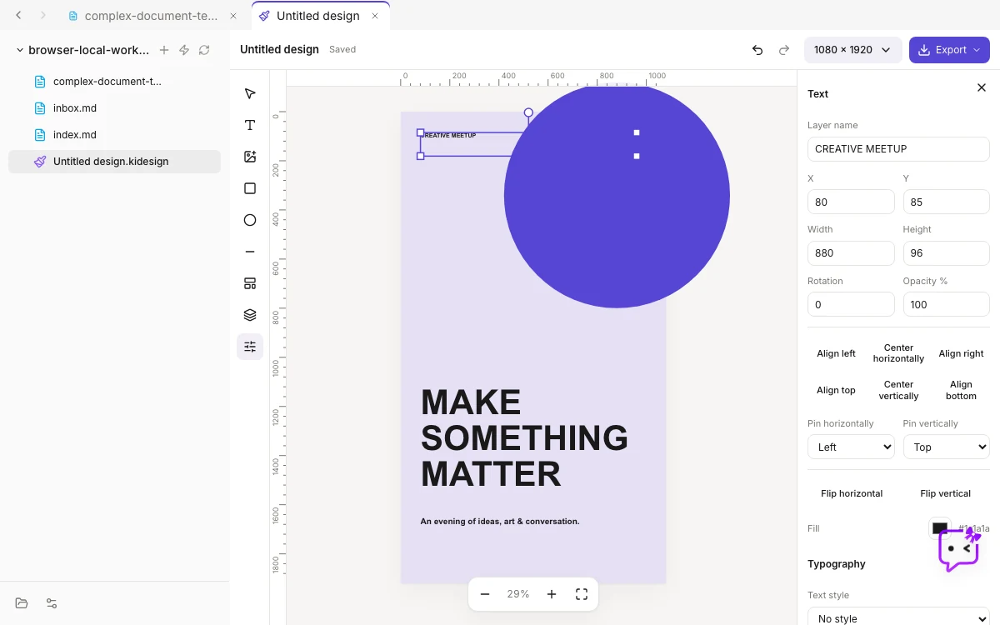

# Design Studio

Kition's Design Studio turns a document, a table record, a Board frame, or an
Agent-generated image into a finished poster or social asset without leaving
the workspace. Designs are ordinary `.kidesign` files: layers, text styles,
size variants, and provenance travel with the file, and every edit stays
undoable.

  

## Start from something you already have

- **Layouts.** A new design opens on the Layouts panel. Each layout is a data
  template under `public/templates/design/` with headline, body, and label
  slots; the workspace brand kit binds its colors and font on insert.
- **Table records.** Right-click a record and choose "Create design from
  record". Fields named title, description, status, and similar fill the
  template slots. The design remembers the record, so "Send to table" later
  attaches the exported image back to that row.
- **Board frames.** Select a frame on a Board and choose "Create design from
  frame". Shapes, text, and images inside the frame become editable layers.
- **Generated images.** "Use in design" on an Agent image result keeps the
  exact text the image was asked for as a separate, editable headline.

## Edit with intent

- **Alignment and distribution.** Align any edge to the selection or the
  artboard, distribute three or more layers with equal gaps, or press Alt with
  A, D, W, S, H, or V. Equal-spacing guides appear while dragging.
- **Constraints.** Each top-level layer pins to an artboard edge, stays
  centered, or scales, so switching a poster to a story keeps the composition.
- **Text styles.** Save a layer's typography as a text style, apply it to other
  layers, and edit a value locally to detach. Four open-license faces (Inter,
  Lora, JetBrains Mono, Bricolage Grotesque) ship with the app and embed in
  exports.
- **Size variants.** Add poster, square, story, or landscape variants that
  share every layer and keep their own positions. Text and style edits reach
  every size.
- **Brand kit.** Settings, then Brand, keeps the workspace colors, font, and
  logo in `.kition/brand.json`. The Brand menu applies a color to the
  selection or the artboard and the font to text layers.
- **Canvas.** Rulers, margin guides, Alt-drag to duplicate, Shift with arrows
  to nudge by ten, text fit to box, and image fill or fit.

## Work with the Agent

With a design open, the Agent receives a bounded description of the artboard,
its layers, and the brand kit. Proposed changes stream onto the canvas as a
preview with accept and reject controls; accepting applies them as one undo
step. "Generate image" opens the image studio at the artboard's aspect ratio
and places the result as a cover-fit layer with an editable headline.

The contract lives in `contracts/runtime/agent-design.schema.json` (capability
`agent_design_v1`). The client validates every patch before it touches the
document.

## Export and hand off

- PNG, JPEG, SVG (fonts and images embedded), and, on the desktop app, PDF at
  the artboard's exact size.
- Scale and background presets are remembered between sessions.
- "Download all sizes" exports every variant.
- "Insert into document" saves the image in the workspace and links it at the
  cursor of the last active document. "Send to table" attaches it to the
  record the design came from. "Copy image" puts it on the clipboard.

## Files and formats

A `.kidesign` file is JSON validated on open. Legacy files without
constraints, text styles, or variants load with defaults. Image assets live
next to the file under `attachments/design/` and are referenced by portable
workspace paths.
