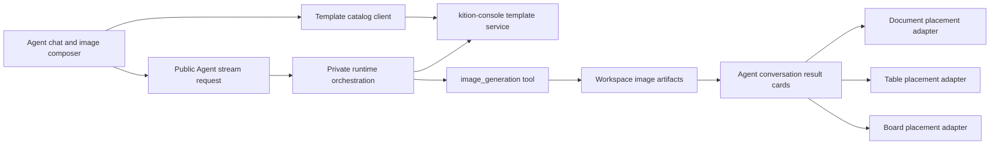

# Unified Agent Image Generation Plan

Status: in progress

Related work: [Native Design Suite Plan](native-design-suite-plan.md) proposes
editable `.kidesign` poster documents built natively in Kition. Design consumes
reviewed image artifacts and adds editable text, shapes, and layouts. Generation
continues in Agent chat; Design's later editing scope extends beyond the initial
release non-goals below without introducing another image-generation Studio.

Research date: 2026-09-05

## Implementation progress

Client-side Phase 0 foundation completed on 2026-09-05:

- added the public
  [`agent-image-generation.schema.json`](../contracts/runtime/agent-image-generation.schema.json)
  contract for typed intents, target contexts, progress, artifacts, errors, and
  provenance;
- added shared TypeScript wire types and the
  `agent_image_generation_v1` capability identifier;
- added optional `image_generation_intent` forwarding to the Agent stream;
- added typed image-generation stream-event parsing, per-session persistence,
  progress replacement, and artifact deduplication;
- retained completed tool-output parsing only as a compatibility fallback for
  runtimes that do not yet emit the typed events.

Client catalog and chat image-mode foundation implemented on 2026-09-05:

- added the public [catalog contract](../contracts/cloud/image-template-catalog.schema.json)
  and [HTTP behavior](../contracts/cloud/README.md) for list and pinned detail responses;
- added validated catalog requests, server search, 24-item cursor pages,
  lazy thumbnails, account-isolated bounded ETag caching, and no-store handling;
- added optional image mode and an in-panel catalog browser to the visible
  Agent composer, with template variables and image settings;
- revalidate a selected immutable template version before sending; preserve
  the draft on failure and allow clearing the template for freeform generation;
- capture document, table, and Board targets with review placement preference;
- display typed progress, partial artifacts, terminal states, and follow-up
  image editing in the originating conversation turn;
- retain completed image tool-output and ordinary artifact previews for older
  stream shapes; deduplicate typed artifacts and refresh workspace resources;
- split conversation rendering out of the oversized chat panel;
- verify client behavior through contract mocks and browser tests. This does
  not establish live Console or private runtime compatibility.

Composer interaction redesigned on 2026-09-07:

- placed file references inside the input area and consolidated tools into
  one footer;
- moved image settings and template browsing into popovers;
- kept the transcript and instruction available while browsing templates;
- added a compact selected-template summary, responsive tool labels, and
  keyboard focus restoration;
- verified narrow panels in light and dark themes, context attachment/removal,
  template validation, submission, and follow-up edits.

Template browsing expanded on 2026-09-08:

- the Image button opens the catalog immediately in a panel to the left of
  chat, up to 760px wide, using the conversation's available height;
- the responsive image grid shows multiple rows of previews alongside the
  composer; smaller windows use a viewport-bounded overlay;
- selecting a template shows a full preview beside its variables and options;
  returning to the catalog preserves its search, page, and scroll position
  while the panel stays open;
- freeform generation, panel dismissal, and exiting image mode remain directly
  accessible; resizing and dismissal preserve the conversation draft;
- browser tests cover the published catalog, left-panel geometry, light and
  dark themes, responsive resizing, keyboard focus, and template submission.

Remaining Phase 2 work includes authoritative image-model availability and
entitlement messaging, durable retry settings after panel/restart recovery,
and broader cancel/reconnect coverage. Retry controls currently reuse settings
held by the mounted composer; typed results recover from runtime-persisted
Agent events. Editable text overlays remain part of the placement phase.

Live integration verified on 2026-09-06:

- Console publishes 16 versioned templates and six localized catalogs. The
  [resolution contract](../contracts/cloud/image-template-resolution.schema.json)
  compiles an exact public template version without accepting workspace paths or
  provider credentials. Restricted templates fail closed.
- The current local development runtime advertises `agent_image_generation_v1`
  and supports image generation, reference editing, persisted progress and
  artifacts, cancellation, and duplicate-request replay.
- A filled template can be submitted without an additional chat draft. Its title
  and supplied variables form the visible instruction; freeform requests still
  require text. Capability status refreshes after backend restarts.
- Black-box validation used the production template endpoint and a test image
  provider. The resulting PNG and persisted events passed the public contract.
  This did not verify a paid image-provider request.

The public pinned runtime release has not changed; packaged clients still need a
runtime release containing this capability. Output dimensions depend on the
image provider's supported sizes; artifacts report decoded image dimensions.

Catalog expansion published on 2026-09-07:

- Console v0.0.51 in `heartie` includes all 541 upstream cases: the original 16
  published adaptations and 525 additional templates. There are 473 generation
  templates and 68 templates requiring a reference image.
- All templates can be browsed before attaching a reference. Sending and server
  resolution continue to enforce reference requirements.
- The chat browser displays the current result range and server `total_count`.
  Preview loading follows the catalog's scroll viewport, with priority for the
  first row, rather than requesting an entire page of images immediately.
- The Console importer pins upstream data and preview hashes, preserves existing
  versions, and provides English and Chinese metadata. Other supported locales
  retain translations for the original 16 and use English fallback for new cases.
- The complete catalog and previews remain server-owned. Public API checks and
  an opt-in browser smoke test verify the deployed catalog without generating
  paid images.

Phase 3 placement adapters, table automation, database-backed Console authoring,
and removal of the prototype Board Studio and bundled catalog remain pending.

## 1. Executive decision

Image generation will be a shared Agent capability for documents, tables, and
Boards. It will not be presented as a separate creation product or as a
Board-only studio.

The primary user experience is one continuous Agent conversation:

1. The user opens or continues the Agent chat beside the active surface.
2. The user selects image mode, optionally chooses a template, and describes
   the desired result in the normal composer.
3. The Agent generates one or more image artifacts and renders the results in
   the conversation.
4. The user reviews the results and inserts or replaces them in the active
   document, table, or Board.
5. Follow-up edits, regeneration, and reference-image changes remain in the
   same conversation.

The image template catalog, prompt recipes, ranking metadata, thumbnails, and
publishing lifecycle will be owned by `kition-console`. The Kition client will
fetch a paginated, searchable catalog instead of bundling a fixed template
library. User-facing wording will call this Kition Cloud, not Console.

The current Board-only Image Studio is a prototype that validates template,
generation, artifact, and placement behavior. Its reusable parts should be
refactored into Agent-owned image-generation components. The standalone Studio
should be removed after the unified chat flow reaches parity.

## 2. Goals

- Make image generation available from document, table, and Board contexts.
- Keep prompting, template selection, generation progress, results, retry, and
  follow-up edits inside the existing Agent conversation.
- Preserve the active Agent session instead of creating a hidden image session.
- Let each editor own only its context capture and artifact-placement rules.
- Support thousands of templates without increasing the desktop bundle size.
- Allow template additions, removals, ranking changes, and prompt fixes without
  releasing a new Kition client.
- Preserve workspace-portable generated image artifacts.
- Reuse the existing Agent stream, image-generation tool, model discovery,
  Kition Account, credit, and workspace asset systems.
- Keep one public client contract that can be implemented by the private
  runtime and `kition-console` without leaking private implementation details.

## 3. Non-goals

- A second top-level image editor or media-generation application.
- A separate chat session created silently for every image request.
- Bundling the full production template catalog or full-size previews in the
  client.
- Replacing the table AI-field automation system with a conversational flow.
- Shipping a node-based image workflow, layer editor, mask editor, or complete
  photo editor in the first unified release.
- Letting templates bypass model capability, credit, entitlement, safety, or
  workspace-write policies.
- Recreating private runtime or `kition-console` source in this repository.

## 4. Product principles

### 4.1 Conversation is the primary surface

Image creation is an Agent task, not a separate document type. A generated
image should appear as part of the turn that created it, with its prompt,
template, progress, artifacts, errors, and follow-up actions visible together.

### 4.2 Templates accelerate a prompt; they do not replace the conversation

A template preconfigures an image intent, variable schema, defaults, and prompt
recipe. The user can still add natural-language instructions before sending.
After generation, the user can continue with requests such as "make it warmer"
or "use the second result but remove the headline" in the same session.

### 4.3 The active surface determines placement, not generation

Generation produces workspace image artifacts. Document, table, and Board
adapters decide how a reviewed artifact is inserted or used as a replacement.
This keeps generation orchestration shared while preserving editor-specific
undo, selection, and persistence semantics.

### 4.4 Explicit review is the default

Results appear in the conversation before editing the active surface. The user
chooses `Insert`, `Replace`, `Add all`, or another surface-specific action.
Automatic placement is allowed only when the user explicitly requests it and
the target is unambiguous.

### 4.5 Freeform generation remains available

Templates are optional. If the catalog is unavailable, the user can still send
a freeform image request when an image-capable provider and runtime capability
are available.

## 5. Unified chat experience

### 5.1 Composer

Add an image mode to `AgentAiComposer` without adding another composer or
modal creation flow.

The compact composer contains:

- an input area with inline file references and an instruction text area that
  grows with the draft up to a fixed maximum;
- one footer with context attachment, image mode, model,
  account, and send or stop controls;
- an optional selected-template summary below the text area, showing its
  thumbnail, name, and aspect ratio.

File references appear directly inside the input area as type icons and
filenames with individual open and remove actions. They wrap when necessary;
long names truncate at the available input width. A single reference row
shares the composer's existing height budget and does not compete with the
model or send controls. Image mode opens the template catalog immediately in
a wide panel to the left of chat. Template variables, image references, aspect
ratio, and variants live in the panel's settings view. Narrow
panels collapse the image-mode label to its icon and truncate filenames.

Advanced settings remain collapsed by default. The main chat model does not
need to be changed to an image model; the runtime routes the image tool to the
configured image-capable model. If no image model is available, the composer
shows a capability-specific configuration action before submission.

Sending image mode creates a normal visible user turn. The structured image
intent accompanies the user text, but it must not be serialized into visible
prompt prose or stored as a hidden user message.

### 5.2 Template browser alongside the Agent panel

Selecting Image opens the catalog directly, with a responsive preview grid,
search, and pagination. The panel uses up to 760px of the space to the left of
chat and up to 780px of the conversation's height. The transcript remains
mounted and the instruction area stays unobstructed on desktop. Windows below
1024px, or layouts with less than 480px to the left of chat, use a bounded
overlay with visible dismissal and freeform actions.

Selecting a template displays its full preview and settings, focusing the
first variable. Returning to the catalog preserves search, page, and scroll
position while the panel stays open. The selected-template summary opens its
settings directly. Done returns focus to the instruction without losing the
draft. Start without a template clears the selection and focuses the composer.
The browser belongs to the Agent panel and the current conversation; it is
not a separate Studio or application route.

The catalog browser provides:

- server-side search;
- cursor pagination or infinite scrolling;
- featured and recommended collections;
- generate and edit operations;
- category, style, scene, aspect-ratio, and input-requirement filters;
- recent templates and optional favorites;
- a compact one-column or two-column layout based on panel width;
- lazy-loaded responsive thumbnails;
- a template details view with variables, defaults, license, and source notice;
- a clear `Use template` action that returns to the composer.

Recommendations use active-surface context such as document type, selected
table fields, selected Board elements, attached reference images, and user
query. Recommendation failures fall back to featured or recent templates.

### 5.3 Generation progress

The submitted turn renders an image-generation task card in the conversation.
The card shows:

- selected template and version, when applicable;
- requested variant count and aspect ratio;
- queued, generating, saving, completed, canceled, or failed status;
- partial results as each workspace artifact becomes available;
- retry and cancel actions;
- credit or capability errors using the existing Kition Account flows.

The conversation remains usable while generation runs. The first release may
allow only one active turn per session, matching the existing Agent stream.
Later concurrency must use explicit jobs in the same conversation, not hidden
sessions.

### 5.4 Result cards

Generated images render as first-class conversation results rather than generic
file rows. Each result supports:

- preview and zoom;
- open in the workspace viewer;
- download or reveal where supported;
- use as a new reference image;
- regenerate or edit through a follow-up turn;
- surface-specific insert and replace actions;
- provenance, template source, model, dimensions, and generation time;
- variant-group navigation and `Add all` where the target supports it.

Placement state is shown on the result card so the user can see whether an
artifact has already been inserted, replaced, or attached.

## 6. Surface behavior

| Surface | Context captured before the turn | Primary result action | Placement rule | Undo boundary |
|---|---|---|---|---|
| Document | Active path, format, cursor or selection anchor, nearby block context, selected image if any | `Insert in document` or `Replace image` | Rich text inserts an image node; Markdown uses the existing safe insertion resolver | One document edit |
| Table | Active data document and table, selected record IDs, selected attachment cell or field, source field values | `Attach to cell`, `Replace attachment`, or `Add to records` | One result targets one cell by default; multi-record placement requires an explicit mapping preview | One table mutation or reviewed batch |
| Board | Active Board path, selection, viewport, target image or placeholder, optional reference raster | `Add to Board`, `Replace image`, or `Add all` | Add near the selection or viewport center; replace only an explicit image target | One Board history command |

### 6.1 Documents

- Markdown insertion must continue using `MarkdownImageInsertionContext` and
  must not insert inside fenced code, frontmatter, or an unrelated block.
- Rich-text insertion uses the current editor selection and native image node.
- A selected existing image enables `Replace image`; otherwise replacement is
  not offered.
- Caption, alt text, and optional editable headline are collected separately
  from the visual prompt.
- Multiple variants remain in chat until the user selects one or explicitly
  inserts all.

### 6.2 Tables

The unified chat flow covers one-off and selected-record image work. Existing
AI fields continue to cover repeatable and automatic batch generation.

- If an attachment cell is selected, the primary action is `Attach to cell`.
- If a record is selected without an attachment target, the Agent can propose
  an existing attachment field or creation of a new one.
- For multiple selected records, the Agent shows a mapping preview between
  records and variants before applying changes.
- Batch AI-field configuration may store a server template ID and version, but
  it must use the same catalog contract instead of copying template metadata
  into table code.
- A conversational template choice can be converted into an AI-field rule only
  through an explicit `Use for this field` action.

### 6.3 Boards

- Board toolbar and selection actions should focus the existing Agent composer,
  switch it to image mode, and attach the selection context.
- They should not open `WhiteboardImageStudio` after migration.
- Generated artifacts remain in the conversation until the user adds or
  replaces them.
- Editable headline overlays remain Board-specific placement metadata rather
  than part of the shared artifact.
- Adding several variants uses stable spacing around the current viewport and
  commits one history command.

## 7. Ownership and architecture



### 7.1 Client ownership

Recommended structure:

```text
src/features/agent/
  components/
    AgentImageComposerControls.tsx
    AgentImageTemplateBrowser.tsx
    AgentImageGenerationCard.tsx
    AgentImageResultGrid.tsx
  hooks/
    useAgentImageGeneration.ts
    useAgentImageTemplateCatalog.ts
  lib/
    agentImageIntent.ts
    agentImageResult.ts

src/features/media-generation/
  api/
    imageTemplates.ts
  lib/
    imageTemplateContract.ts
    imageGenerationContract.ts

src/features/document/
  lib/
    documentImagePlacement.ts

src/features/table/
  lib/
    tableImagePlacement.ts

src/features/whiteboard/
  lib/
    whiteboardImagePlacement.ts
```

Responsibilities:

- `agent` owns composer mode, template selection state, request lifecycle,
  conversation cards, retries, cancellation, and follow-up generation.
- `media-generation` owns server contract types, catalog API access, normalized
  template metadata, and shared generation option types.
- `document`, `table`, and `whiteboard` own target capture, placement preview,
  mutation, undo, and editor refresh.
- `workspace` connects the active pane and its adapter to the Agent panel. It
  must not absorb image-generation presentation or lifecycle logic.
- `app` remains bootstrap and shell glue only.

### 7.2 Placement adapter contract

Define a client-only adapter interface similar to:

```ts
type AgentImagePlacementAdapter = {
  surface: 'document' | 'table' | 'whiteboard'
  captureTarget(): AgentImageTargetContext | undefined
  describeActions(artifacts: AgentImageArtifact[]): AgentImagePlacementAction[]
  place(input: AgentImagePlacementInput): Promise<AgentImagePlacementResult>
}
```

The shared Agent layer must not import editor stores directly. Workspace
composition supplies the active adapter. Each placement call validates that
the target revision, selection, and path are still safe before mutating data.

## 8. Public client and runtime contract

Add a public JSON schema under `contracts/runtime/` before private runtime
implementation. The schema should define:

### 8.1 Image intent

- `request_id`;
- `operation`: `generate` or `edit`;
- optional `template_id` and immutable `template_version`;
- locale;
- user instruction;
- normalized template variables;
- aspect ratio, quality, resolution, and variant count;
- reference workspace paths;
- active surface;
- a compact target-context snapshot;
- placement preference: `review`, `insert`, or `replace`;
- client capability version.

Add the optional typed intent to the Agent stream request. Plain user text
continues to carry conversational meaning; the typed object carries stable
execution parameters.

### 8.2 Stream events

The public stream needs stable events for:

- image job accepted;
- generation progress;
- partial artifact created;
- image job completed;
- image job failed or canceled.

Every event must include `request_id`. Artifact delivery must include the full
public `AgentArtifact` or an equivalent stable artifact reference. The client
may retain completed `image_generation` tool output as a compatibility fallback,
but the final contract must not require scraping arbitrary tool output shapes.

### 8.3 Provenance

Each generated artifact should expose portable provenance metadata:

- generation request ID;
- variant group and index;
- template ID and version;
- model identifier and provider class;
- prompt hash, not necessarily the private resolved prompt;
- source artifact references;
- dimensions and MIME type;
- created timestamp;
- safety or moderation disposition when applicable.

## 9. `kition-console` template service

### 9.1 Catalog responsibilities

`kition-console` owns:

- template records and immutable published versions;
- locale-aware title, description, variable labels, and discovery text;
- private prompt recipes and variable interpolation rules;
- categories, tags, styles, scenes, operations, and capability requirements;
- responsive preview images and CDN delivery;
- featured collections and recommendation ranking;
- source, author, license, attribution, and takedown metadata;
- free, account-required, and premium entitlements;
- safety review and publication state;
- analytics-driven ranking with manual editorial overrides;
- draft, preview, published, deprecated, and retired lifecycle states.

### 9.2 Catalog API

The client-facing API should provide versioned endpoints equivalent to:

```text
GET /api/media/image-templates
GET /api/media/image-templates/{template_id}
GET /api/media/image-template-collections
```

List queries should accept:

- `cursor` and `limit`;
- `query`;
- `operation`;
- `category`, `style`, and `scene`;
- `surface`;
- `has_reference_image` and `has_selection_text`;
- `locale`;
- `collection` or recommendation context;
- an optional client capability version.

Responses should include `ETag`, cache directives, a catalog revision, and
responsive thumbnail URLs. List responses contain summaries; prompt recipes
and large detail payloads are never shipped in the list.

### 9.3 Template execution

The client submits template ID, version, user variables, and freeform
instruction through the Agent intent. The private runtime asks
`kition-console` to validate entitlement and resolve the published template
recipe before invoking the image tool.

This separation provides:

- prompt fixes without a client release;
- deterministic versioning for retries and audit;
- one entitlement and safety decision point;
- support for Kition Cloud and approved external image providers;
- protection against stale or client-modified template recipes.

Freeform requests do not require a template resolution call. If server
templates are unavailable, the client keeps freeform image mode available when
the configured runtime supports it.

### 9.4 Authoring and operations

The Console-side authoring workflow should include:

1. Create a draft template and variable schema.
2. Upload responsive previews.
3. Record source and license metadata.
4. Validate prompt interpolation and supported model parameters.
5. Generate review samples across required aspect ratios.
6. Run safety, attribution, and editorial review.
7. Publish an immutable version to a staged audience.
8. Promote, roll back, deprecate, or retire without deleting historical
   versions referenced by prior artifacts.

## 10. Catalog performance and caching

- Do not import production template thumbnails through the JavaScript bundle.
- Use server-side search and cursor pagination; do not download the whole
  catalog for client-side filtering.
- Request small thumbnails for list cards and larger previews only for details.
- Lazy-load previews near the viewport and cancel stale searches.
- Cache catalog summaries by query, locale, and catalog revision.
- Use `ETag` revalidation and a bounded local cache for recent templates.
- Cache only metadata and thumbnails that the account is allowed to view.
- A stale cached template may be displayed, but submission must revalidate its
  version and entitlement.
- Show a lightweight catalog-unavailable state without blocking freeform chat.

## 11. Session and job lifecycle

- An image request uses the current visible Agent session.
- The request ID is created before send and remains stable across stream events,
  retries, artifacts, and placement actions.
- Retrying with unchanged settings keeps the original template version unless
  the user explicitly chooses `Use latest version`.
- A follow-up edit references the prior artifact and request ID.
- Cancel stops the active generation job but leaves the user turn and partial
  artifacts visible.
- Navigating to another editor does not lose the conversation or job.
- Result actions use the current active adapter only after confirming that the
  stored target is still valid.
- Closing the Agent panel does not create a background hidden session.
- If same-session concurrency is added later, it requires explicit job IDs and
  independent cancellation; it must not infer completion from session busy
  state alone.

## 12. Capability, account, and entitlement behavior

The client evaluates four independent conditions:

1. Agent streaming is available.
2. An image-generation tool and image-capable model are available.
3. The user can access the selected server template.
4. The selected surface has a valid placement target for the requested action.

The composer explains the failing condition at the point of action. A missing
Kition Account may block premium templates or Kition Cloud generation, but it
must not be reported as a generic model error. Credit exhaustion reuses the
existing Kition Account billing flow.

Entitlement is enforced on the server. Client badges and disabled states are
advisory UX, not authorization.

## 13. Localization, accessibility, privacy, and legal requirements

- Client-owned UI copy remains in `src/i18n/locales/<locale>/`.
- Server catalog content is requested with a locale and falls back to English.
- Template identifiers, category identifiers, and analytics identifiers remain
  locale-independent.
- Template cards, filters, previews, progress, and result actions must be fully
  keyboard accessible.
- Preview images require localized alt text or a safe generated fallback.
- The catalog browser must preserve focus when returning to the composer.
- Prompt text, document context, table values, and Board selection data are not
  sent to catalog search unless required for an explicit recommendation request.
- Recommendation analytics should use template IDs and coarse surface context;
  raw user prompts are excluded by default.
- Source and license notices are server data and remain visible from template
  details and generated-result provenance.
- Retiring a template must preserve attribution and version metadata for
  previously generated artifacts.

## 14. Migration from the current prototype

### Stage A: stabilize shared contracts

- Extract current image option and artifact-normalization types from
  Board-specific files into `media-generation`.
- Define the public image intent and stream-event schemas.
- Preserve the completed-tool-output fallback until all supported runtimes emit
  typed image artifact events.

### Stage B: introduce the server catalog behind a capability flag

- Add the client catalog API and normalized template types.
- Serve the current small template set from `kition-console` as the first
  production collection.
- Keep the bundled prototype catalog only as development fixtures during the
  transition.
- Add pagination, search, locale, cache, entitlement, and failure-state tests.

### Stage C: integrate image mode into Agent chat

- Add composer image mode and the in-panel template browser.
- Send normal visible chat turns with typed image intents.
- Render progress and result cards in the conversation.
- Keep image jobs tied to the visible session and request ID.

### Stage D: ship placement adapters

Recommended order:

1. Document insertion and replacement, because safe Markdown insertion already
   exists.
2. Board add, replace, editable overlay, and multi-variant placement.
3. Table cell attachment, replacement, selected-record mapping, and reviewed
   batch apply.

### Stage E: unify table automation

- Add optional template ID and version to image AI-field configuration.
- Reuse the same template browser and server catalog.
- Keep recurring/batch execution in the table pipeline rather than Agent chat.

### Stage F: remove duplicate Board UI and bundled production data

- Redirect Board image actions to the Agent composer.
- Remove `WhiteboardImageStudio` and Board-owned generation lifecycle state.
- Remove production template definitions and thumbnails from the client bundle.
- Retain only contract fixtures and small test assets required for deterministic
  tests.

## 15. Delivery phases and PR boundaries

### Phase 0: decision and public contracts

Deliverables:

- approve this plan;
- define schemas for image intent, progress, artifacts, and provenance;
- add client mocks for typed image stream events;
- document capability and fallback behavior.

Exit gate: client and private-service teams agree on stable request and event
shapes.

### Phase 1: `kition-console` catalog MVP

Deliverables:

- versioned catalog storage and publishing lifecycle;
- list, detail, collection, search, locale, and ETag behavior;
- responsive preview delivery;
- prompt resolution and entitlement validation;
- migration of the current licensed template set.

Exit gate: a new published template is discoverable by a released client
without a client update.

### Phase 2: Agent chat image mode

Deliverables:

- composer controls;
- in-panel catalog browser;
- typed intent submission;
- progress, partial result, error, cancel, retry, and result cards;
- freeform fallback and capability messaging.

Exit gate: image generation starts, finishes, and supports follow-up editing in
one visible conversation without opening another creator or session.

### Phase 3: document, Board, and table placement

Deliverables:

- three placement adapters;
- revision and stale-target validation;
- surface-specific insert, replace, and multi-result behavior;
- atomic undo and persistence;
- cross-surface navigation while a job is running.

Exit gate: the same generated artifact can be reviewed in chat and explicitly
placed into any supported surface.

### Phase 4: catalog scale and table automation

Deliverables:

- large-catalog performance budgets;
- recommendation collections, recent items, and optional favorites;
- template-backed table AI fields;
- operational dashboards for search, generation success, and template quality;
- staged rollout, deprecation, and rollback tools.

Exit gate: catalog size no longer affects client bundle size or initial Agent
panel load.

### Phase 5: cleanup and general availability

Deliverables:

- remove the standalone Board Studio and production bundled catalog;
- accessibility, localization, account, entitlement, privacy, and legal review;
- compatibility testing against supported runtime versions;
- release evidence and support documentation.

Exit gate: there is one product image-generation workflow and one production
template source of truth.

## 16. Test strategy

### Contract tests

- template list, detail, pagination, locale fallback, ETag, and versioning;
- intent validation and limits;
- typed progress, partial artifact, completion, failure, and cancellation events;
- provenance and entitlement fields;
- old-runtime compatibility fallback.

### Agent component tests

- switching between normal and image mode without losing the draft;
- selecting, replacing, and clearing a template;
- keyboard search and infinite catalog loading;
- capability, account, entitlement, and credit states;
- partial results, retry, cancel, follow-up edit, and result deduplication;
- session continuity and no hidden-session creation.

### Surface tests

- Markdown safe insertion and selected-image replacement;
- rich-text cursor insertion and undo;
- table cell attach, replacement, multi-record preview, and atomic apply;
- Board add, replace, add-all, editable overlay, and one-step undo;
- stale target, renamed path, changed selection, deleted row, and closed Board
  handling.

### End-to-end tests

- freeform image generation from each surface;
- template generation from each surface;
- one conversation generating an image, inserting it into a document, then
  adding the same artifact to a Board;
- a template catalog larger than one page with search and lazy thumbnails;
- catalog outage with freeform generation still available;
- generation success when the runtime emits typed artifact events;
- compatibility when only completed tool output includes the artifact path;
- Kition Account sign-in, premium entitlement, credit exhaustion, and retry;
- restart and navigation recovery while a generation result is awaiting review.

## 17. Metrics and release criteria

Track without raw prompt content by default:

- image mode opened by surface;
- freeform versus template generation;
- template impression, selection, and generation success by template ID and
  version;
- time to first artifact and time to completed turn;
- retry, cancel, and failure reason;
- result insertion and replacement rate by surface;
- catalog search zero-result rate;
- placement failure and stale-target rate;
- percentage of image turns that continue with a follow-up edit.

General availability requires:

- no standalone production Image Studio entry point;
- no hidden session for a normal image request;
- typed request IDs across generation, artifacts, and placement;
- document, table, and Board placement with atomic undo;
- server-owned templates with pagination, search, versioning, and entitlement;
- acceptable panel responsiveness with at least 10,000 catalog records in load
  tests;
- no production template catalog or full preview set in the client bundle;
- accessibility and localization checks passing;
- public contract, client mock, private runtime, and Console black-box tests
  passing.

## 18. Recommended decisions

The following decisions should be accepted with this plan unless product or
service constraints require a revision:

1. Use the current visible Agent session for image requests.
2. Keep result review in chat and require explicit placement by default.
3. Treat document, table, and Board as placement adapters, not generation
   owners.
4. Keep table AI fields for automation while sharing the same server template
   catalog.
5. Store published template recipes only on `kition-console`; the client sends
   template ID, immutable version, variables, and user instruction.
6. Keep freeform generation available independently of template catalog
   availability.
7. Remove the standalone Board Studio after the unified flow reaches parity.
8. Require typed image job stream events, while retaining tool-output parsing as
   a temporary runtime compatibility fallback.
