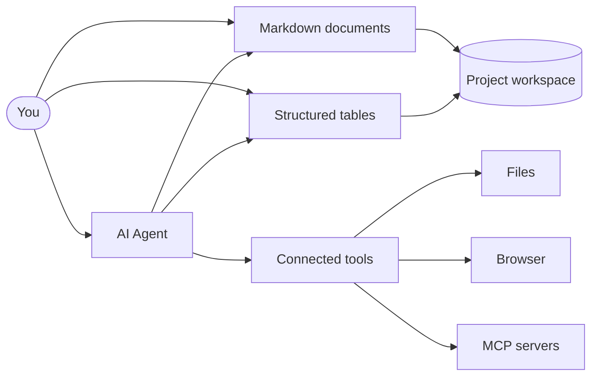

# Welcome to Kition

Kition brings Markdown documents, structured tables, visual workflows, and an AI agent together inside one focused workspace. Start with a real project, then write, organize, research, and automate without switching tools.

> [!tip] Everything here is editable
> This document is a plain Markdown file. Click anywhere and start typing. The tables and guides beside it are ordinary workspace files too. Keep what is useful, adapt it to your work, and remove the rest.

## Start with one useful action

- **Write**: edit this document, add a checklist, and create an `[[internal link]]`.
- **Organize**: open [[Essentials/Task Tracker.kitable]] and switch between Grid, Kanban, and Calendar.
- **Automate**: open [[Essentials/Contact Directory.kitable]], select **Workflows**, and run the contact cleanup flow.
- **Connect**: follow [[Guides/Email Automation/intro.md]] to import an inbox into a structured table and open full messages as Markdown.
- **Research**: copy or adapt a prompt from [[Guides/Web Research/info.md]] to open a website and continue the requested browser task automatically.
- **Ask**: open the Agent and ask it to summarize this page or update the active document.

## How Kition fits together



The Agent works with the document or table you are viewing. It can use connected tools, browse through a controlled browser, and call MCP servers that you configure.

## What makes Kition different

| Capability | What it means | What to try |
| --- | --- | --- |
| Portable documents | Notes remain readable `.md` files. | Edit this page and inspect it outside Kition. |
| Structured data | Each table is stored as a portable table file. | Add a row to **Task Tracker**. |
| Multiple views | One dataset can power several layouts. | Switch Task Tracker between Grid, Kanban, and Calendar. |
| Visual workflows | Records can trigger deterministic actions. | Run the Contact Directory cleanup workflow. |
| Inbox automation | IMAP messages become table rows linked to local Markdown. | Open the **Email Automation** guide. |
| AI fields | Generated values come from selected source fields. | Inspect the AI Summary field in **Reading Tracker**. |
| Model choice | Use Kition Cloud or a compatible provider. | Open **Settings > AI Models**. |

## Write rich documents

Use `#` for headings, `-` for lists, and `[[` to create an internal document link. Live preview renders callouts, code, diagrams, tables, and math while the file on disk stays clean Markdown.

For example, compound growth can be written as:

$$
V_n = V_0(1 + r)^n
$$

For a starting value of $V_0 = 100$, a rate of $r = 0.08$, and $n = 5$ periods:

$$
V_5 = 100(1.08)^5 \approx 146.93
$$

> [!note] You choose where workspace files live
> Documents, tables, and workflow data remain in the folder you select. Kition sends prompts and selected context to an AI provider only when you choose an AI action. Deterministic workflows do not require an AI service.

## Build structured tables

Table fields can hold text, numbers, dates, choices, checkboxes, attachments, formulas, relations, lookups, and AI-generated values. A formula can turn quantity and unit price into a total without changing the source fields:

```text
quantity * unit_price
```

| Included table | What to explore | Included pattern |
| --- | --- | --- |
| [[Essentials/Task Tracker.kitable]] | Status, priority, due dates, and views | Personal work tracking |
| [[Essentials/Reading Tracker.kitable]] | Progress and AI-generated summaries | On-demand AI fields |
| [[Essentials/Contact Directory.kitable]] | Contact fields and workflow runs | Deterministic cleanup |
| [[Workflow Examples/Content Pipeline.kitable]] | Editorial planning | Create records in another table |
| [[Workflow Examples/Expense Review.kitable]] | Numbers and review states | Conditional record updates |
| [[Workflow Examples/Order Fulfillment.kitable]] | Product and order data | Cross-table lookup and write-back |

> [!note] AI fields run on demand
> Open **Reading Tracker** and inspect the **AI Summary** column. Generated fields run only when you request them, so you control when a model receives selected context.

## Try three deterministic workflows

These examples require no email account, AI model, or external service.

1. **Flag high-value expenses**: open [[Workflow Examples/Expense Review.kitable]], test a large expense, and inspect the status update.
2. **Fill orders from a catalog**: open [[Workflow Examples/Order Fulfillment.kitable]], match an SKU, and write product details back to the order.
3. **Normalize contact details**: open [[Essentials/Contact Directory.kitable]], extract an email domain, and reduce a formatted phone number to digits.

Together they demonstrate conditions, same-record updates, cross-table lookup, write-back, and deterministic transforms.

## Work with the Agent

Useful first prompts are concrete and scoped to the active file:

```text
Summarize this page in five bullets and add a checklist for my first Kition session.
```

```text
Review the active table, identify missing values, and propose a cleanup workflow without running it.
```

The Agent should explain planned changes before modifying workspace content. You remain in control of tool access, provider settings, and the files it can reach.

## Getting Started directory

Everything included in Getting Started is indexed below. The folders are named for product functions, not internal sample categories.

### Root

| Path | Purpose |
| --- | --- |
| `Welcome to Kition.md` | This product overview and complete onboarding index. |
| `logo.png` | The image displayed at the top of this page. |
| `Essentials/` | Small tables for core document, data, and workflow features. |
| `Workflow Examples/` | Deterministic automation patterns that need no external service. |
| `Guides/` | End-to-end setup and product walkthroughs. |

### Essentials

| Path | Purpose |
| --- | --- |
| [[Essentials/Task Tracker.kitable]] | Table views, status tracking, dates, and task workflows. |
| [[Essentials/Reading Tracker.kitable]] | AI-generated fields driven by structured source columns. |
| [[Essentials/Contact Directory.kitable]] | A deterministic workflow that normalizes email and phone data. |

### Workflow Examples

| Path | Purpose |
| --- | --- |
| [[Workflow Examples/Content Pipeline.kitable]] | Create records in a publishing queue from another table. |
| [[Workflow Examples/Expense Review.kitable]] | Filter high-value records and update the triggering row. |
| [[Workflow Examples/Order Fulfillment.kitable]] | Look up product data and write matching fields back to an order. |

### Guides

| Path | Purpose | Requirement |
| --- | --- | --- |
| [[Guides/Email Automation/intro.md]] | Import an IMAP inbox into a `.kitable`, open messages as Markdown, and configure SMTP delivery. | Email provider credentials |
| [[Guides/Email Automation/Inbox.kitable]] | The schema-complete inbox table filled by the Email Automation sync workflow. | Email provider credentials to populate |
| [[Guides/Lead Automation/intro.md]] | Walk through a record-created lead workflow. | None to inspect |
| [[Guides/Lead Automation/Lead Follow-up.kitable]] | Inspect a workflow with bound email fields. | Email connection to send |
| [[Guides/Receipt Extraction/intro.md]] | Learn a prompt pattern for receipt extraction. | AI provider to run again |
| [[Guides/Receipt Extraction/Receipt Archive.kitable]] | Filter and review completed receipt records. | None to inspect |
| [[Guides/Product Content/intro.md]] | Configure image and copy generation fields. | Image-capable AI provider to run again |
| [[Guides/Product Content/Product Content Studio.kitable]] | Inspect configured product content fields. | None to inspect |
| [[Guides/Web Research/info.md]] | Test a reusable one-turn browser handoff for page research, capture, summaries, downloads, or structured output. | Desktop browser and AI provider |

## Recommended first session

- [ ] Edit this page and save it.
- [ ] Add a row to **Task Tracker** and change the active view.
- [ ] Run the cleanup workflow in **Contact Directory**.
- [ ] Open **Email Automation** and review the inbox-to-table output structure.
- [ ] Copy or adapt a prompt from **Web Research** and verify that the requested result exists before the Agent reports completion.
- [ ] Ask the Agent to summarize one active file.
- [ ] Open one guide that matches your work and adapt its table.

These onboarding files are yours to change. Build the workspace around real work, and keep your source files under your own control.
