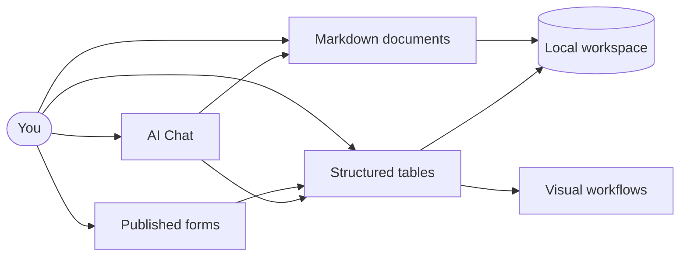

# Welcome to Kition

Kition brings Markdown documents, structured tables, visual workflows, forms, and AI Chat together in one focused workspace. This welcome document stays at the workspace root, while ready-to-open examples are grouped inside **Getting Started**.

> [!tip] Everything here is editable
> This page is a plain Markdown file. Keep the sections that help, rewrite them for your team, or delete the page after you are comfortable with the workspace.

## Start with one useful action

- **Write**: edit this document, add a checklist item, or create an `[[internal link]]`.
- **Organize**: create a folder and move related documents or tables into it.
- **Use a template**: open **Template Center** and choose a starting structure.
- **Collect data**: add a form view to a table and publish it when remote submissions are needed.
- **Ask**: open AI Chat and ask Kition to summarize the active document or table.

## How Kition fits together



Documents remain portable files. Tables keep typed fields, views, records, forms, and workflow configuration together. Published forms can collect submissions remotely and synchronize them back into the matching table.

## What makes Kition useful

| Capability | What it means | What to try |
| --- | --- | --- |
| Portable documents | Notes remain readable `.md` files. | Edit this page and inspect it outside Kition. |
| Structured data | Related records and field types stay together. | Create a table from Template Center. |
| Multiple views | One table can use grid, kanban, calendar, gallery, or form views. | Add a second view to a table. |
| Published forms | A configured form can collect remote submissions. | Publish a form and submit one test response. |
| Visual workflows | Record events can trigger repeatable actions. | Inspect the workflow area of a template. |
| AI fields and chat | AI can work with selected fields or active workspace context. | Ask for a summary before requesting changes. |

## Explore the template library

Open **Template Center** from the workspace create menu. Each template creates an independent `.kitable` file, so you can safely change fields, views, records, forms, and workflows without modifying the original template.

The built-in templates cover different kinds of work:

| Template | Best for | Notable structure |
| --- | --- | --- |
| [[Getting Started/Projects & Planning/Task Tracker.kitable]] | Delivery planning and ownership | Status, priority, assignee, and due-date views |
| [[Getting Started/Sales & Customer/Simple Client CRM.kitable]] | Prospects, clients, quotes, and follow-up | Relationship and pipeline fields |
| [[Getting Started/Sales & Customer/Leads Landing Page.kitable]] | Capturing and qualifying inbound leads | Form, pipeline, source, and estimated-value fields |
| [[Getting Started/Sales & Customer/SDR Cold Call Manager.kitable]] | Prioritizing outbound calls and follow-up | Call stages, attempts, calendar, and ownership |
| [[Getting Started/Projects & Planning/Product Launch Website.kitable]] | Coordinating a site from concept to publication | Content, assets, owners, and launch stages |
| [[Getting Started/Projects & Planning/Project Gantt Planner.kitable]] | Planning project dependencies and delivery dates | Timeline-ready dates, progress, status, and owners |
| [[Getting Started/Operations & Analytics/Business Analytics Dashboard.kitable]] | Revenue, cost, margin, and collections | Metric-oriented records and summaries |
| [[Getting Started/Operations & Analytics/Email Inbox Sync.kitable]] | Importing an IMAP mailbox into structured records | Message metadata with Markdown-backed content |
| [[Getting Started/AI & Creative/Receipt OCR Database.kitable]] | Turning receipt images into searchable data | Attachments, OCR text, structured JSON, and review status |
| [[Getting Started/AI & Creative/YouTube & TikTok Thumbnail Generator.kitable]] | Creating distinct social cover concepts | Portrait input, story brief, prompt, and generated image fields |
| [[Getting Started/AI & Creative/Batch Product Designer.kitable]] | Developing product concepts and campaign assets | Creative briefs, image fields, and social copy |
| [[Getting Started/Operations & Analytics/Restaurant Operations.kitable]] | Reservations, guest preferences, and private events | Calendar, kanban, and publishable form views |

> [!note] Template copies are independent
> If a filename ends in `2`, `3`, or another number, it is a separate copy. Keep the version you are using and remove extra experiments when you no longer need them.

## Keep starter templates together

The **Getting Started** folder is divided by purpose so the workspace root stays calm and each example is easy to find. For ongoing work, create project folders and move active tables closer to their related documents.

A simple organization can look like this:

```text
Welcome to Kition.md
Getting Started/
  AI & Creative/
    Batch Product Designer.kitable
    Receipt OCR Database.kitable
    YouTube & TikTok Thumbnail Generator.kitable
  Sales & Customer/
    Leads Landing Page.kitable
    SDR Cold Call Manager.kitable
    Simple Client CRM.kitable
  Projects & Planning/
    Product Launch Website.kitable
    Project Gantt Planner.kitable
    Task Tracker.kitable
  Operations & Analytics/
    Business Analytics Dashboard.kitable
    Email Inbox Sync.kitable
    Restaurant Operations.kitable
Projects/
  Product launch/
  Customer research/
Archive/
```

Normal Markdown notes, imported images, and project files do not need to move into Getting Started. Use the folder for the welcome guide and template examples, not as a permanent home for everything.

## Build structured tables

Table fields can hold text, numbers, dates, choices, checkboxes, attachments, formulas, relations, lookups, and AI-generated values.

A formula can turn quantity and unit price into a total without changing either source field:

```text
quantity * unit_price
```

For general compound growth, Markdown math remains available in documents:

$$
V_n = V_0(1 + r)^n
$$

For a starting value of $V_0 = 100$, a rate of $r = 0.08$, and $n = 5$ periods:

$$
V_5 = 100(1.08)^5 \approx 146.93
$$

## Configure and publish a form

Form views let you choose which table fields are visible, required, or read-only for respondents.

1. Open a `.kitable` file and select the target table.
2. Add or open a **Form** view.
3. Set the title, description, field order, visibility, and required fields.
4. Preview the form and submit a local test response.
5. Publish the form to Kition Cloud when a public or remote link is needed.
6. Confirm that the response appears in the source table.

> [!note] The table remains the source of truth
> A published form is an input surface for one table. New submissions should synchronize into that table instead of creating a disconnected dataset.

## Work with workflows

Use a workflow when a record change should trigger deterministic follow-up, such as normalizing text, assigning a status, copying a record, or sending data to an approved integration.

Before enabling a workflow:

- verify the trigger;
- review every mapped input field;
- test against one sample record;
- confirm the result in the destination table or service;
- enable automation only after the test behaves as expected.

## Work with AI Chat

Useful first prompts are concrete and scoped to the active file.

With this page active:

```text
Summarize this guide in five bullets and add a checklist for my first Kition session.
```

With a template table active:

```text
Review this table, identify missing values, and propose a cleanup plan without changing any records yet.
```

With Receipt OCR Database active:

```text
Explain the extraction fields and suggest a validation checklist for newly uploaded receipts.
```

AI Chat should explain planned changes before modifying workspace content. You remain in control of provider settings, tool access, and the files it can reach.

## Explore optional onboarding guides

Open **Settings > Onboarding Guides** when you want a larger, guided example. Import only the guide that matches the work you want to test.

| Guide | What it demonstrates | Requirement |
| --- | --- | --- |
| Email Automation | Inbox sync, Markdown messages, and SMTP delivery | Email provider credentials |
| Lead Automation | A record-created follow-up workflow | None to inspect |
| Receipt Extraction | A reusable structured extraction prompt | AI provider to run again |
| Product Content | Image and copy generation fields | Image-capable AI provider to run again |
| Web Research | A reusable browser task handoff | Desktop browser and AI provider |

> [!note] Optional guides stay optional
> The first-run workspace contains this root-level welcome page plus categorized, ready-to-open templates inside Getting Started. Optional guides appear only when you import them.

## Recommended first session

- [ ] Edit this page and save it.
- [ ] Open two templates from this folder and compare their views.
- [ ] Rename the template copy you want to use for a real project.
- [ ] Add or preview a form view.
- [ ] Ask AI Chat to summarize one active file.
- [ ] Remove unused template copies after testing.

These onboarding files are yours to change. Build the workspace around real work, and keep your source files under your own control.
