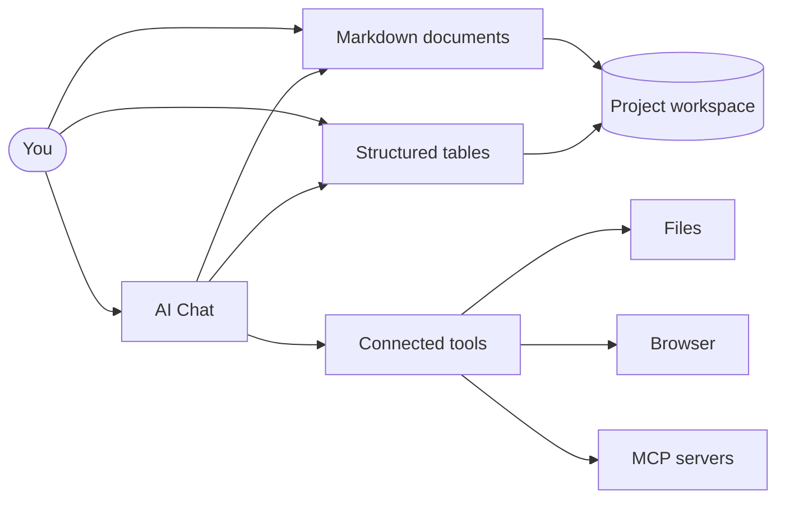

# Welcome to Kition

Kition brings Markdown documents, structured tables, visual workflows, and AI Chat together inside one focused workspace. Start with a real project, then write, organize, research, and automate without switching tools.

> [!tip] Everything here is editable
> This page is a plain Markdown file and a tour of the elements Kition can render. Click anywhere and start typing. Keep what is useful, adapt it to your work, and remove the rest.

## Start with one useful action

- **Write**: edit this document, add a checklist item, and create an `[[internal link]]`.
- **Organize**: open [[Contact Directory.kitable]] and change a record.
- **Automate**: select **Workflows** in Contact Directory and inspect the deterministic cleanup flow.
- **Ask**: open AI Chat and ask Kition to summarize this page or help organize the table.

## How Kition fits together



AI Chat works with the document or table you are viewing. It can use connected tools, browse through a controlled browser, and call MCP servers that you configure.

## What makes Kition different

| Capability | What it means | What to try |
| --- | --- | --- |
| Portable documents | Notes remain readable `.md` files. | Edit this page and inspect it outside Kition. |
| Structured data | Tables keep related records and field types together. | Add a row to Contact Directory. |
| Visual workflows | Records can trigger deterministic actions. | Inspect the Contact Directory workflow. |
| Rich Markdown | One file can contain tables, diagrams, math, code, and callouts. | Explore every section on this page. |
| Model choice | Use Kition Cloud or a compatible provider. | Open **Settings > AI Models**. |

## Write rich documents

Use `#` for headings, `-` for lists, and `[[` to create an internal document link. Live preview renders callouts, code, diagrams, tables, and math while the file on disk stays clean Markdown.

For example, compound growth can be written as:

$$
V_n = V_0(1 + r)^n
$$

For a starting value of $V_0 = 100$, a rate of $r = 0.08$, and $n = 5$ periods:

$$
V_5 = 100(1.08)^5 \approx 146.93
$$

> [!note] You choose where workspace files live
> Documents, tables, and workflow data remain in the folder you select. Kition sends prompts and selected context to an AI provider only when you choose an AI action. Deterministic workflows do not require an AI service.

## Build structured tables

Table fields can hold text, numbers, dates, choices, checkboxes, attachments, formulas, relations, lookups, and AI-generated values. A formula can turn quantity and unit price into a total without changing the source fields:

```text
quantity * unit_price
```

The starter table demonstrates a compact, local workflow:

| Included file | What to explore | Included pattern |
| --- | --- | --- |
| `Welcome to Kition.md` | Rich Markdown and AI Chat context | Portable documents |
| [[Contact Directory.kitable]] | Contact fields, records, and workflow runs | Deterministic cleanup |
| `logo.png` | Relative image embedding | Workspace media |

## Try a deterministic workflow

Open [[Contact Directory.kitable]], select **Workflows**, and inspect how the sample flow normalizes contact details. It demonstrates repeatable actions without requiring an email account, an AI model, or another external service.

1. Review the trigger and its input fields.
2. Run the workflow against a sample record.
3. Compare the updated email domain and phone number with the original values.

## Work with AI Chat

Useful first prompts are concrete and scoped to the active file.

With this page active:

```text
Summarize this page in five bullets and add a checklist for my first Kition session.
```

With Contact Directory active:

```text
Review this table, identify missing values, and propose a cleanup plan without changing any records yet.
```

AI Chat should explain planned changes before modifying workspace content. You remain in control of tool access, provider settings, and the files it can reach.

## Explore optional guides

Open **Settings > Onboarding Guides** when you want a larger example. Import only the guide that matches your work.

| Guide | What it demonstrates | Requirement |
| --- | --- | --- |
| Email Automation | Inbox sync, Markdown messages, and SMTP delivery | Email provider credentials |
| Lead Automation | A record-created follow-up workflow | None to inspect |
| Receipt Extraction | A reusable structured extraction prompt | AI provider to run again |
| Product Content | Image and copy generation fields | Image-capable AI provider to run again |
| Web Research | A reusable browser task handoff | Desktop browser and AI provider |

> [!note] Optional guides stay optional
> The first-run workspace contains only this page, its logo, and Contact Directory. Guides are added only when you choose to import them.

## Recommended first session

- [ ] Edit this page and save it.
- [ ] Add a row to Contact Directory.
- [ ] Inspect the contact cleanup workflow.
- [ ] Ask AI Chat to summarize one active file.
- [ ] Import one optional guide that matches your work.

These onboarding files are yours to change. Build the workspace around real work, and keep your source files under your own control.
